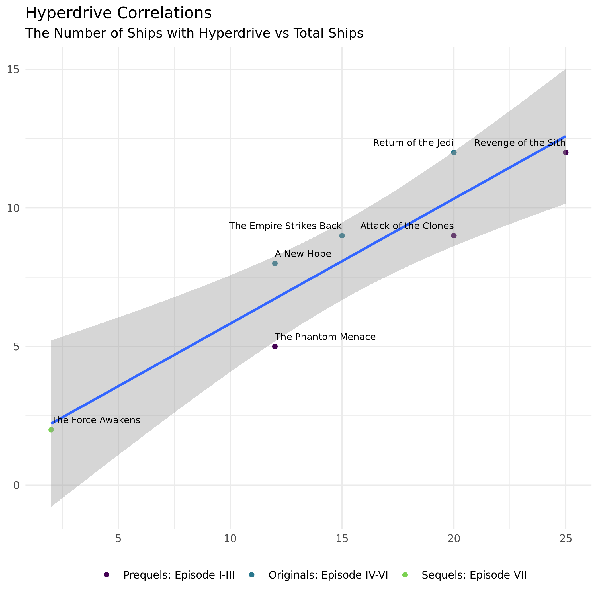

```{r}
#| label: setup
#| include: false
library(tidyverse)
library(repurrrsive) #this contains the data sw_films, may need to install
library(magrittr)
```

```{r}
#| label: data-prep
#| include: false
#using this later to add a variable to our data
trilogies <- factor(
  c("Prequels: Episode I-III", 
    "Originals: Episode IV-VI", 
    "Sequels: Episode VII"), 
  levels = c("Prequels: Episode I-III", 
             "Originals: Episode IV-VI", 
             "Sequels: Episode VII"))
```

***This task is complex. It requires many different types of abilities. Everyone will be good at some of these abilities but nobody will be good at all of them. In order to produce the best product possible, you will need to use the skills of each member of your group.***

<!-- The person who who is going the farthest from CSUMB this summer starts as the Computer (typing and listening to instructions from the Coder)!  -->

- Starting Computer:  

- Starting Coder:  


## Goals for the Activity

-   Apply methods of to use lists and iteration (using `purrr`) to extract data from various non-tabular data sets.  
-   Create new data sets through the cleaning, organization, and joining of data from various sources  
-   Create visualizations to explore the data\
-   May the force be with you!

## Review: Extracting Information from Different Data Sets

Here is information about the fist 7 Star Wars films:

```{r}
#| label: sw_films
#| eval: false
View(sw_films) 
```

We are going to explore the data contained in several lists similar to this one (and the previously explored `sw_people`), combining skills from all of our previous R code learning experiences.

How do the following two codes compare?

```{r}
#| label: compare-code
sw_films[[4]][["title"]]
sw_films |> pluck(4,"title")
```

> Insert Answer Here

Suppose we want to pull out just the titles as a character vector, select the correct code (comment out the rest) to perform this action. You may want to run each line of code one at a time (remember `Ctrl + Enter` for Windows with your cursor on that line of code).


```{r}
#| label: pull-titles
#comment out the incorrect codes
map_chr(sw_films, "title")
sw_films |> map("title")
sw_films |> map_chr("title")
sw_films |> map_dfc("title")
```

Suppose we want to apply a function to count the number of specific kinds of ships and vehicles in our data

Notice that for each film, the "starships" vector contains links to information on those starships (though note this data is out of date and should be linked at swapi.dev, not swapi.co).

```{r}
#| label: starship-links
sw_films[[1]][["starships"]]
```

So if we can count the number of webpage links that would tell us the number of starships that appear in that movie. Here are three different ways to count the number of urls under `starships`. Can you think of another? (it is ok if you can't). Compare and contrast how the three codes work differently to do the same thing.

```{r}
#| label: count-links
sw_films |> map("starships") |> map_dbl(~length(.x))
map_dbl(sw_films, ~length(.x$starships))
map_dbl(sw_films, \(x) length(pluck(x, "starships")))
sw_films |> map_dbl(~length(.x$starships))
```

> Insert Answer


<!-- Swap roles -- Computer becomes Coder, Coder becomes Computer! -->

## Part 1: Evaluating Hyperdrive in the Star Wars Episodes

We will use the third method from the previous section to extract out the information we want from `sw_films`. For each row, specify if we should use a regular `map()`, `map_dbl()`, or `map_chr()`.

**NOTE** Sometimes code like this gets a little finicky in R if you try to run it with `Ctrl + Enter`. Instead, use the code chunk green arrow to run the whole code chunk or highlight all of the code and then use the shortcut to run it.


<!-- Look at the instructions for the final table. -->

```{r}
#| label: ship-counts
sw_ships_1 <- tibble(
    title = map____(sw_films, "title"), #character
    episode = map____(sw_films, "episode_id"), #numeric
    starships = map____(sw_films, ~length(.x$starships)), #numeric
    vehicles = map____(sw_films, ~length(.x$vehicles)), #numeric
    planets = map____(sw_films, ~length(.x$planets)) #numeric
  )
sw_ships_1
```


<!-- Swap roles -- Computer becomes Coder, Coder becomes Computer! -->

Let's do a bit more data cleaning to 1) assign the Trilogy classification to each episode, 2) calculate the total number of starships (which have hyperdrive) and vehicles (which do not have hyperdrive), and 3) calculate the proportion of total ships that have hyperdrive. Fill in the missing codes.


<!-- Look at the instructions for the final table. -->

```{r}
#| label: create-new-variables
sw_ships <- sw_ships_1 ____  
  #create a new variable called trilogy
  ____(trilogy = case_when(episode %in% 1:3 ~ trilogies[1],
                             episode %in% 4:6 ~ trilogies[2],
                             episode %in% 7 ~ trilogies[3])) |> 
  #create a new variable called total_ships which adds vehicles and starships together
  ____(total_ships = vehicles + starships) |>  
  #create a new variable called prop that calculate the percent hyperdrive
  ____(percent = starships / total_ships * 100) 
```


### Hyperdrive Use Across Films

Now, let's make a plot examining how often hyperdrive ships appear in each episode. You will modify the code below to replicate the visualzation.

Fill in the blanks withe appropriate functions.

<!-- Look at the instructions for the final graph. -->

```{r}
#| label: bar-plot
sw_ships |> 
  #be sure to order titles by order/episode
  ggplot(aes(y = ____(title, desc(episode)), 
             x = percent)) + 
  #we want bars but our data is already summarized!
  geom_____(aes(fill = trilogy)) + 
  labs(
    title = "The Rise of Hyperdrive",
    subtitle = "Percentage of Ships with Hyperdrive Capability"
  ) +
  #you may need to install `scales` package if you haven't already
  scale_x_continuous(labels = scales::label_percent(scale = 1)) +
  theme_minimal() +
  #what aesthetic do we modify to change the bar color
  scale______viridis_d(end = 0.8) +
  theme(axis.title.x = element_blank(),
        axis.title.y = element_blank(),
        legend.position = "bottom",
        legend.title = element_blank())

```


#### Canvas Quiz Question 1

Which movie has the second highest percentage of Hyperdrive ships?

> Insert Answer Here


<!-- Swap roles -- Computer becomes Coder, Coder becomes Computer! -->

### Hyperdrive Prevalence within the Universe

We can also look at a plot to see if there is a correlation between the total number of ships and the number with hyperdrive (starships).

{fig-alt="Scatter plot showing the relationship between the total number of ships and the number of starships with hyperdrive capability across the Star Wars episodes, colored by trilogy group and labeled with episode titles."}

Fill in the blanks withe appropriate functions.


<!-- Look at the instructions for the final graph. -->

```{r}
#| label: ships-graph
  ggplot(aes(x = total_ships, 
             y = starships)) +
  #make points
  geom_______(aes(color = trilogy)) +
  #fit a model
  geom_______(method = "lm") +
  #what does geom_text() do?
  geom_text(aes(label = title), 
            vjust = -1, 
            hjust = "inward", 
            size = 2.75) +
  labs(title = "Hyperdrive Correlations",
       subtitle = "The Number of Ships with Hyperdrive vs Total Ships") +
  theme_minimal() +
  #what aesthetic do we want to modify the color of points?
  scale________viridis_d(end = 0.8) +
  theme(axis.title.x = element_blank(),
        axis.title.y = element_blank(),
        legend.position = "bottom",
        legend.title = element_blank()) 
```


#### Canvas Quiz Question 2

What do you notice about the use of hyperdrive type vehicles in the episodes?

> Insert Answer


<!-- Swap roles -- Computer becomes Coder, Coder becomes Computer! -->

## Part 2: The Physical Features of Star Wars Characters

<!-- For each of the following, look at the instructions for the final table format. -->

Recall the data for "people" in Star Wars:

```{r}
#| eval: false
View(sw_people)
```

We want to extract out `name`, `height`, and `mass` as `character` vectors (for now, we have to deal with some issues in height and weight later to change them into double type vectors) and keep `films` as a list for now. Fill in the correct `map` type functions for each one.

```{r}
#| label: sw-peeps
sw_peeps <- tibble(
    name = ____(sw_people, "name"),  #character
    height = ____(sw_people, "height"), #character
    mass = ____(sw_people, "mass"), #character
    films = map____(sw_people, "films") #list
  )
sw_peeps
```


<!-- Swap roles -- Computer becomes Coder, Coder becomes Computer! -->

Notice that the `films` column contains lists of urls for each film reference. Let's pull out that same information from the `sw_films` data to have the `title` of the episode and the `url` as a `character` vector, and the episode number as a numeric value. Fill in the correct `map` type functions.

```{r}
#| label: film-names
film_names <- tibble(
    episode_id = ____(sw_films, "episode_id"), #double
    episode_name = ____(sw_films, "title"), #character
    url = ____(sw_films, "url") #character
  )
film_names
```


<!-- Swap roles -- Computer becomes Coder, Coder becomes Computer! -->

Now we can finish cleaning up our data by doing the following:

1)  turn `height` and `mass` into numeric vectors;\
2)  match the `films`/`urls` to their `episode_names` and assign that back to `sw_peeps`.

```{r}
#| label: sw-peeps2
sw_peeps2 <- sw_peeps |> 
  #use a function from readr to extract the numbers and replace "unknown" with na
  mutate(height = parse_____(height, na = "unknown"),
         mass = parse_____(mass, na = "unknown")) |>
  #unnest the lists in films
  ____(cols = c("films")) |> 
  #join the film data with episodes names to the people data
  _____join(film_names, by = c("films" = "url")) |> 
  #remove the `films` url from the data frame
  ____(-films) |> 
  #add the variable trilogy
  ____(trilogy = case_when(episode_id %in% 1:3 ~ trilogies[1],
                           episode_id %in% 4:6 ~ trilogies[2],
                           episode_id %in% 7   ~ trilogies[3]))
sw_peeps2
```

<!-- Swap roles -- Computer becomes Coder, Coder becomes Computer! -->

### Size of Characters in the Star Wars Universe

We can now create a plot of height and mass by trilogy group to see if the physique of characters differed across Trilogies (keeping in mind the third set of Trilogies is incomplete in this data set). 

<!-- Look at the instructions for the final graph. -->

```{r}
#| label: scatter-people
# be sure to also hide any warnings or messages within this code chunk
sw_peeps2 |> 
  filter(name != "Jabba Desilijic Tiure") |> #major outlier removed
  #map the correct aesthetics
  ggplot(aes(x = ____, 
             y = ____, 
             color = ____)) +
  geom_point(position = "jitter") +
  geom_smooth(method = "lm", se = FALSE) +
  labs(x = "Height of Character (cm)",
       y = "Mass of Character (kg)",
       color = "Trilogy Group",
       title = "Character Characteristics in Star Wars") +
  theme_minimal() +
  scale_color_viridis_d(end = 0.8) 
```


#### Canvas Quiz Question 3

Write some code to identify who is is the heaviest (look at the graph to help guide this) Star Wars character (excluding Jabba Desilijic Tiure).

```{r}
#| label: heaviest-character


```


>Insert Answer Here
