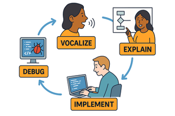

During our in-class activities, you will be paired with another student. When completing the activity, you will rotate between the following roles:

-   Coder – Proposes solution strategies
-   Computer – Processes solution strategy

The strategy relies on the code "vocalizing" their ideas and "explaining" them to the computer. The computer can ask questions, but will ultimately "implement" the coder's instructions. Then they either move forward or "debug" their work.

{fig-alt="A cycle of two individuals, the first shows the coder vocalize their goals, the second shows the coder explain their goals, then the computer implements the coder's instructions, then they debug" fig-align="center"}

Here are more details for how each role should engage with the task and each other through each step of the process:

::: panel-tabset
## Computer

+----------------------------------------------------------------------------------------+-----------------------------------------------------------------------------------------------------------+--------------------------------------------------------------+------------------------------------------------------------------------------------------------------------------------------+
| Vocalize                                                                               | Explain                                                                                                   | Implement                                                    | Debug                                                                                                                        |
+========================================================================================+===========================================================================================================+==============================================================+==============================================================================================================================+
| -   Be curious, but don’t correct.                                                     | -   Encourages the Coder to vocalize their thinking.                                                      | -   Types the code specified by the Coder into the notebook. | -   If code does not run or has errors, asks the Coder questions about how to debug the proposed solution strategy.          |
|                                                                                        |                                                                                                           |                                                              |                                                                                                                              |
| -    Listen to the Coder read the prompt and ensure that everyone understands.         | -    Asks the Coder clarifying questions, but does not offer their own view.                              | -   Runs the code provided by the Coder.                     | -   Once code runs, ask the Coder to evaluate the output relative to the prompt to ensure the output addresses the question. |
|                                                                                        |                                                                                                           |                                                              |                                                                                                                              |
| -   Listens carefully, asks the Coder to repeat statements if needed, or to slow down. | -   Ask the Coder about what comments to make in the notebook to help the team understand the code later. |                                                              | -   **Do not** tell the Coder how to correct an error.                                                                       |
|                                                                                        |                                                                                                           |                                                              |                                                                                                                              |
| -   **Do not** give hints to the Coder for how to solve the problem.                   |                                                                                                           |                                                              |                                                                                                                              |
|                                                                                        |                                                                                                           |                                                              |                                                                                                                              |
| -   **Do not** solve the problem yourself.                                             |                                                                                                           |                                                              |                                                                                                                              |
+----------------------------------------------------------------------------------------+-----------------------------------------------------------------------------------------------------------+--------------------------------------------------------------+------------------------------------------------------------------------------------------------------------------------------+
| **Questions**                                                                          | **Questions**                                                                                             | **Questions**                                                | **Questions**                                                                                                                |
|                                                                                        |                                                                                                           |                                                              |                                                                                                                              |
| -   What are you focusing on?                                                          | -   Why do you think that?                                                                                | -   Is this the correct syntax?                              | -   Why do you think the code didn’t /did work?                                                                              |
|                                                                                        |                                                                                                           |                                                              |                                                                                                                              |
| -   What are you thinking now?                                                         | -   Could you tell me more?                                                                               | -   What are the arguments?                                  | -   What do you think the error message indicates?                                                                           |
|                                                                                        |                                                                                                           |                                                              |                                                                                                                              |
| -   Do you understand what we need to do?                                              | -   Run that by me again.                                                                                 | -   Which package is that from?                              | -   What’s the question we have for the instructor? Can we answer the question ourselves?                                    |
|                                                                                        |                                                                                                           |                                                              |                                                                                                                              |
| -    What other sources of information do we need?                                     | -   Could you elaborate?                                                                                  | -   Am I missing anything?                                   | -   What else do we need to complete this problem?                                                                           |
|                                                                                        |                                                                                                           |                                                              |                                                                                                                              |
| -   Which functions should we look up?                                                 | -   Can we pause, because I’m confused.                                                                   |                                                              |                                                                                                                              |
+----------------------------------------------------------------------------------------+-----------------------------------------------------------------------------------------------------------+--------------------------------------------------------------+------------------------------------------------------------------------------------------------------------------------------+

## Coder

+---------------------------------------------------------------------------------------+----------------------------------------------------------------------------------------------------------------------+--------------------------------------------------------------------------------------------------+-------------------------------------------------------------------------------------------------------------------+
| Vocalize                                                                              | Explain                                                                                                              | Implement                                                                                        | Debug                                                                                                             |
+=======================================================================================+======================================================================================================================+==================================================================================================+===================================================================================================================+
| -   Reads out loud instructions or prompts.                                           | -   If needed, remind the Computer that they are the one to vocalize now.                                            | -   Directs the Computer what to type in the notebook.                                           | -   Revises solution strategy based on evaluation / debugging conversations with the Computer.                    |
|                                                                                       |                                                                                                                      |                                                                                                  |                                                                                                                   |
| -   Share with the Computer about ideas related to ways they could solve the problem. | -   Share with the Computer their thought process.                                                                   | -   Check that the Computer is interpreting the code correctly and provide correction as needed. | -   Tells the Computer about what comments to update in the notebook to help the group understand the code later. |
|                                                                                       |                                                                                                                      |                                                                                                  |                                                                                                                   |
| -   If needed, remind the Computer that they are the one to vocalize now.             | -   Talks with Computer about what comments to make in the notebook to help the group understand the code later.     |                                                                                                  | -   **Do not** ask the Computer to debug the code.                                                                |
|                                                                                       |                                                                                                                      |                                                                                                  |                                                                                                                   |
| -   Manages resources (e.g., cheatsheets, textbook) for aiding in solution strategy.  |                                                                                                                      |                                                                                                  |                                                                                                                   |
|                                                                                       |                                                                                                                      |                                                                                                  |                                                                                                                   |
| -   **Do not** ask the Computer how they would solve the problem.                     |                                                                                                                      |                                                                                                  |                                                                                                                   |
|                                                                                       |                                                                                                                      |                                                                                                  |                                                                                                                   |
| -   **Do no**t ask the Computer what functions / tools they should use.               |                                                                                                                      |                                                                                                  |                                                                                                                   |
+---------------------------------------------------------------------------------------+----------------------------------------------------------------------------------------------------------------------+--------------------------------------------------------------------------------------------------+-------------------------------------------------------------------------------------------------------------------+
| **Statements**                                                                        | **Statements**                                                                                                       | **Statements**                                                                                   | **Statements**                                                                                                    |
|                                                                                       |                                                                                                                      |                                                                                                  |                                                                                                                   |
| -   Read the prompt…                                                                  | -   I think this will work because…                                                                                  | -   Start with…                                                                                  | -   I think the bug might be coming from…                                                                         |
|                                                                                       |                                                                                                                      |                                                                                                  |                                                                                                                   |
| -   It seems like the goal is to…                                                     | -   I chose this approach because…                                                                                   | -   The arguments to the function should be…                                                     | -   What if we try…                                                                                               |
|                                                                                       |                                                                                                                      |                                                                                                  |                                                                                                                   |
| -   I am confused by…                                                                 | -   I wonder what happens if we…                                                                                     | -   I think the correct syntax is…                                                               | -   I am thinking about…                                                                                          |
|                                                                                       |                                                                                                                      |                                                                                                  |                                                                                                                   |
| -   This reminds me of…                                                               | -   If we run this, I expect it to…                                                                                  | -   I think the correct variable name is…                                                        | -   Let’s look at the resources for…                                                                              |
|                                                                                       |                                                                                                                      |                                                                                                  |                                                                                                                   |
| -   I am thinking about…                                                              | -   The comments we should include are…                                                                              |                                                                                                  |                                                                                                                   |
|                                                                                       |                                                                                                                      |                                                                                                  |                                                                                                                   |
| -   I notice that…                                                                    |                                                                                                                      |                                                                                                  |                                                                                                                   |
|                                                                                       |                                                                                                                      |                                                                                                  |                                                                                                                   |
| -   We could try…                                                                     |                                                                                                                      |                                                                                                  |                                                                                                                   |
|                                                                                       |                                                                                                                      |                                                                                                  |                                                                                                                   |
| -   I am looking for a function/package that…                                         |                                                                                                                      |                                                                                                  |                                                                                                                   |
+---------------------------------------------------------------------------------------+----------------------------------------------------------------------------------------------------------------------+--------------------------------------------------------------------------------------------------+-------------------------------------------------------------------------------------------------------------------+
:::

In addition to the above protocol, remember the following:

## Team Norms

1.  Be curious. Don't correct.
2.  Be open minded.
3.  Ask questions rather than contribute.
4.  Respect each other.
5.  Allow each teammate to contribute to the activity through their role.
6.  Do not divide the work.
7.  No cross talk with other groups.
8.  Communicate with each other!

## Completing the Task

Working with your partner, complete the Activity in the notebook provided. In your roles—Coder and Computer—use the prompts above to help guide the completion of your activity.

## Once You’re Finished

At the end of the task, your group will have one completed notebook, containing your team’s worked-out solutions and justifications. Everyone must take turns writing the final product (as described above) and everyone must be able to explain every line of code in your final document. Your activity will be submitted to the group assignment.
