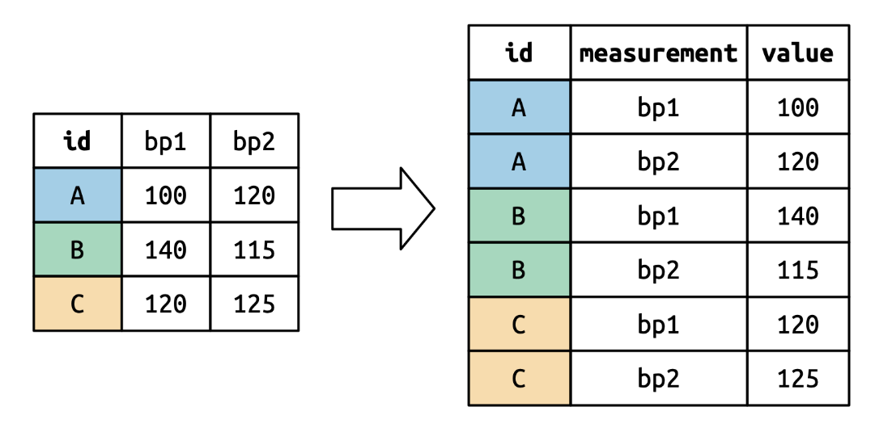

Today you will use the `readxl`, `dplyr`, and `tidyr` packages to clean some
data and then recreate a visualization of military expenditures for countries in
Eastern Europe. 

***This task is complex. It requires many different types of abilities. Everyone will be good at some of these abilities but nobody will be good at all of them. In order to solve this puzzle, you will need to use the skills of each member of your group.***

# Groupwork Protocols

During the Practice Activity, you and your partner will alternate between two roles---Computer and Coder.

When you are the **Computer**, you will type into the Quarto document in RStudio. However, you **do not** type your own ideas. Instead, you type what the Coder tells you to type. You are permitted to ask the Coder clarifying questions, and, if both of you have a question, you are permitted to ask the professor. You are expected to run the code provided by the Coder and, if necessary, to work with the Coder to debug the code. Once the code runs, you are expected to collaborate with the Coder to write code comments that describe the actions taken by your code.

When you are the **Coder**, you are responsible for reading the instructions / prompts and directing the Computer what to type in the Quarto document. You are responsible for managing the resources your group has available to you (e.g., cheatsheet, textbook). If necessary, you should work with the Computer to debug the code you specified. Once the code runs, you are expected to collaborate with the Computer to write code comments that describe the actions taken by your code.

Here are more details of the [Pair Programming Protocols](../pair-programming-norms.qmd)


### Group Norms

Remember, your group is expected to adhere to the following norms:  

1. Be curious. Don't correct. 
2. Be open minded.
3. Ask questions rather than contribute. 
4. Respect each other.
5. Allow each teammate to contribute to the activity through their role. 
6. Do not divide the work.
7. No cross talk with other groups. 
8. Communicate with each other!


\newpage


## Lengthening Data

::: columns
::: {.column width="40%"}
```{r}
#| eval: false
#| echo: true
#| label: pivot-from-r4ds

df |> 
  pivot_longer(
    cols = bp1:bp2,
    names_to = "measurement",
    values_to = "value"
  )
```
:::

::: {.column width="5%"}
:::

::: {.column width="55%"}

:::
:::


## Code Formatting

Don't forget, writing "tidy" and "well documented" code are two of the learning
targets for this course. As such, I would strongly encourage you to use every
opportunity to practice these skills.

As you are writing code for this assignment, make sure your code follows the
[tidyverse style guide for dplyr code](https://style.tidyverse.org/pipes.html).
Specifically, your code should:

-   use whitespace liberally
    -   before & after every `=` sign
    -   after every `,`
    -   before every `|>`
-   use new lines liberally
    -   after every `|>`
    -   after `,` when needed (if code is more than 80 characters in length)