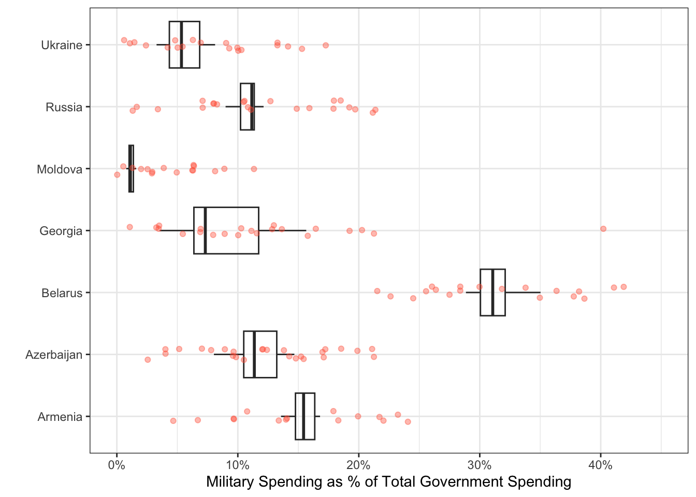

```{r}
#| label: setup
#| include: false
library(readxl) 
library(tidyverse)
```

Today you will be tidying messy data to explore the relationship between
countries of the world and military spending. You can find the
`gov_spending_per_capita.xlsx` data included in the `data` folder. 

***This task is complex. It requires many different types of abilities. Everyone will be good at some of these abilities but nobody will be good at all of them. In order to solve this puzzle, you will need to use the skills of each member of your group.***

# Groupwork Protocols

During the Practice Activity, you and your partner will alternate between two roles---Computer and Coder.

When you are the **Computer**, you will type into the Quarto document in RStudio. However, you **do not** type your own ideas. Instead, you type what the Coder tells you to type. You are permitted to ask the Coder clarifying questions, and, if both of you have a question, you are permitted to ask the professor. You are expected to run the code provided by the Coder and, if necessary, to work with the Coder to debug the code. Once the code runs, you are expected to collaborate with the Coder to write code comments that describe the actions taken by your code.

When you are the **Coder**, you are responsible for reading the instructions / prompts and directing the Computer what to type in the Quarto document. You are responsible for managing the resources your group has available to you (e.g., cheatsheet, textbook). If necessary, you should work with the Computer to debug the code you specified. Once the code runs, you are expected to collaborate with the Computer to write code comments that describe the actions taken by your code.

Here are more details of the [Pair Programming Protocols](../pair-programming-norms.qmd)

::: {.callout-note}
The partner who woke up the earliest today will start as the Computer (typing and listening to instructions from the Coder). 
:::

### Group Norms

Remember, your group is expected to adhere to the following norms:  

1. Be curious. Don't correct. 
2. Be open minded.
3. Ask questions rather than contribute. 
4. Respect each other.
5. Allow each teammate to contribute to the activity through their role. 
6. Do not divide the work.
7. No cross talk with other groups. 
8. Communicate with each other!

# Goals for the Activity

- Continue practice using `dplyr` verbs, `readxl` commands, and other data cleaning learned.  
- Use `tidyr` to pivot data into a form ready for data visualizaiton.  


**THROUGHOUT** the Activity be sure to follow the Style Guide by doing the following:

-   load the appropriate packages at the beginning of the Quarto doc\
-   use proper spacing\
-   name all code chunks\
-   comment at least once in each code chunk to describe why you made your coding decisions\
-   add appropriate labels to all graphic axes

## Setting up your Project

Your project should have the following components:

1. completed [pa-7-tidyr-dplyr-activity.qmd](../week-8/pa-7-tidyr-dplyr-activity.qmd)
2. rendered file as `.html`
3. folder called `data` that contains the original data file  
    - [gov_spending_per_capita.xlsx](../week-8/data/gov_spending_per_capita.xlsx)

::: {.callout-important}
The original `Computer` should submit the zip file for the canvas quiz. The original `Coder` can just submit the rendered html file. 

`Computer` - Be sure to share the final .qmd and .html file with the original `Coder`.
:::


## Data Description

We will be using data from the Stockholm International Peace Research Institute
(SIPRI). The SIPRI Military Expenditure Database is an open source data set
containing time series on the military spending of countries from 1949--2019. 
The database is updated annually, which may include updates to data from
previous years.

Military expenditure is presented in many ways:

+ in local currency and in US $ (both from 2018 and current);
+ in terms of financial years and calendar years;
+ as a share of GDP and per capita.

The availability of data varies considerably by country, but we note that data
is available from at least the late 1950s for a majority of countries that were
independent at the time. Estimates for regional military expenditure have been
extended backwards depending on availability of data, but no estimates for total
world military expenditure are available before 1988 due to the lack of data
from the Soviet Union.

SIPRI military expenditure data is based on open sources only.

## Data Import and Cleaning

First, you should notice that there are ten different sheets included in the dataset. We are interested in the sheet labeled *"Share of Govt. spending"*, 
which contains information about the share of all government spending that is
allocated to the military.

Next, you'll notice that there are notes about the data in the first six rows.
Ugh! Also notice that the last six rows are footnotes about the data. **Ugh**!

Rather than copying this one sheet into a new Excel file and deleting the first
and last few rows, let's learn something new about the `read_xlsx()` function!

The `read_xlsx()` function has several useful arguments:

+ `sheet`: specify the name of the sheet that you want to use. The name must be
passed in as a string (in quotations)!
+ `skip`: specify the number of rows you want to skip *before* reading in the
data.
+ `n_max`: specify the maximum number of rows of data to read in.  
+ `na`: specify the ways that `NA` is coded in the data, formatted `c("a","b")`

**1. Comment the code below to read the military expenditures data into your workspace, identifying why each setting was chosen.**

```{r}
#| label: read-in-military-data

military <- read_xlsx("data/gov_spending_per_capita.xlsx",  #comment
                      sheet = "Share of Govt. spending",    #comment
                      skip  = 7,                            #comment
                      n_max = 191,                          #comment
                      na = c("xxx", ". ."))                  #comment
```

*I would highly recommend you open the dataset in Excel, so you can see the data layout!*


<!-- Swap roles -- Computer becomes Coder, Coder becomes Computer! -->

## Filtering Unwanted Rows

If you give the `Country` column a look, you'll see there are names of **continents and regions** included. These names are only included to make it
simpler to find countries, as they contain no data.

Luckily for us, these region names were also stored in the *"Regional totals"*
sheet. We can use the `Region` column of this dataset to filter out the names we
don't want.

Run the code below to read in the *"Regional totals"* data.

```{r}
#| label: regional-totals
cont_region <- read_xlsx("data/gov_spending_per_capita.xlsx", 
                      sheet = "Regional totals", 
                      skip = 14,
                      n_max = 36) |> 
  filter(Region != "World total (including Iraq)", 
         Region != "World total (excluding Iraq)")
```

**2. Why does this code produce output that says 'New names: ``->`...73`**

::: {.callout-note}
In the most recently updated `dplyr 1.2.0` package, there are functions such as `filter_out()` that will make this more intuitive. You can update on your personal computer to use the new functions, but the server cannot be updated without installing the package every time since it is updated once a semester.  [Learn more about the release of `dplyr 1.2.0`](https://tidyverse.org/blog/2026/02/dplyr-1-2-0/)
:::

We can use the function `pull()` to extract just the values of the column `Region`.

```{r}
#| label: id-regions
regions <- cont_region |> 
  pull(Region)
```

Then we can use that to filter out or exclude the rows that contain regions instead of countries.

```{r}
#| label: filter-regions
military_clean <- military |> 
  filter(!Country %in% regions)
```


**3. Write a sentence describing what the line of code `filter(!Country %in% regions)` is doing in the context of the data.**  


### Canvas Question #1

**4. Complete the code below to figure out what four regions were NOT removed from the `military_clean` data set?**  

*Hint: the regions that were not removed have missing values for every column except `Country`.* 

```{r}
#| label: inspecting-what-regions-were-not-removed

military_clean |> 
  filter(if_all(.cols = _________,   #hint: what is the easiest way to include every column except `Country`
                .fns = ~function(.))   #hint: replace function with one in R (there are several) tests if a value is missing or is NA?
         )
```

```{r}
#| label: inspecting-what-regions-were-not-removed-SOLUTION
#| include: false

military_clean |> 
  filter(if_all(.cols = -Country,   #hint: what is the easiest way to include every column except `Country`
                .fns = ~is.na(.))   #hint: what function in R (there are several) tests if a value is missing or is NA?
         )
```

## Data Organization

<!-- Swap roles -- Computer becomes Coder, Coder becomes Computer! -->

We are interested in comparing the military expenditures of countries in Eastern
Europe. Our desired plot looks something like this:



Unfortunately, if we want a point representing the spending for every country
and year, we need every year to be a **single column**!

To tidy a dataset like this, we need to pivot the columns of years from wide
format to long format. To do this process we need three arguments:

+ `cols`: The set of columns that represent values, not variables. In these
data, those are all the columns from `1988` to `2019`.

+ `names_to`: The name of the variable that should be created to move these
columns into. In these data, this could be `"year"`.

+ `values_to`: The name of the variable that should be created to move these
column's values into. In these data, this could be labeled `"spending"`.

These form the three required arguments for the `pivot_longer()` function.

**5. Pivot the cleaned up `military` data set to a "longer" orientation. Save this new "long" version as a new object called `military_long`.**  

Hint: **Do not** overwrite your cleaned up dataset!

```{r}
#| label: pivoting-military-data-longer


```


## Data Visualization

<!-- Swap roles -- Computer becomes Coder, Coder becomes Computer! -->

Now that we've transformed the data, let's create a plot to explore military
spending across Eastern European countries.

**6. Create side-by-side boxplots to explore the military spending between Eastern European countries.**

Hint 1: You will need to remove all other countries except the Eastern European ones before initiating your plot.  

Hint 2: Place the `Country` variable on an axis that makes it easier to read the
labels

Hint 3: Make sure you change the plot title and axis labels to accurately
represent the plot.

```{r}
#| label: side-by-side-boxplots-east-europe

# Countries to include in the plot! 
eastern_europe <- c("Armenia", 
                    "Azerbaijan",
                    "Belarus", 
                    "Georgia", 
                    "Moldova", 
                    "Russia", 
                    "Ukraine")

# Hint - look at the code chunk `filter-regions` and Question 3 for code similar to what you will want to use to filter out just these countries.  

```

### Canvas Question 2 & Question 3

**7. Looking at the plot you created above, which Eastern European country had the second highest median military expenditure?.**


**8. Looking at the plot you created above, which Eastern European country had the largest variability in military expenditures over time?**


