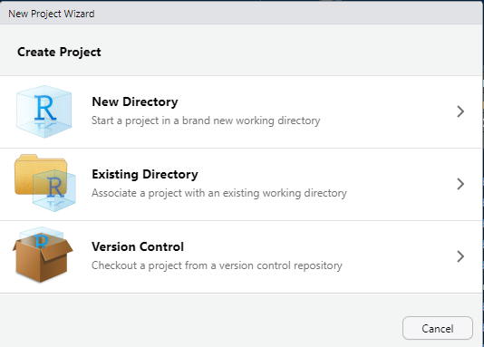
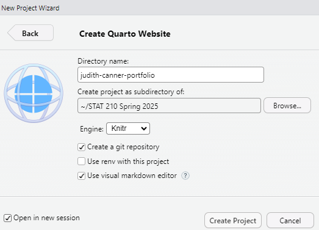
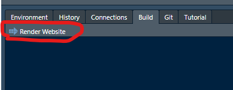
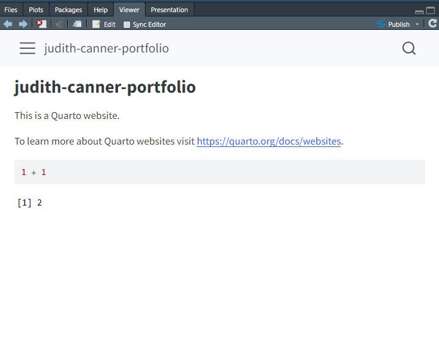
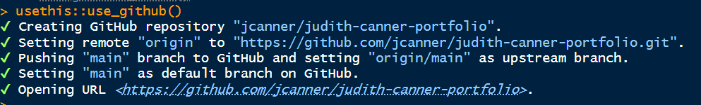
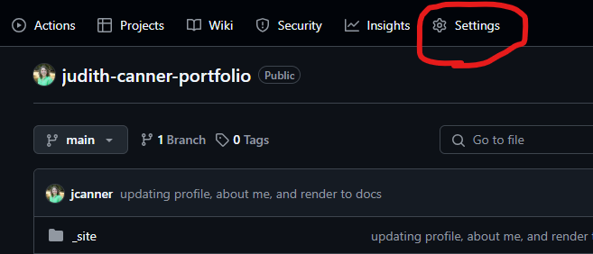
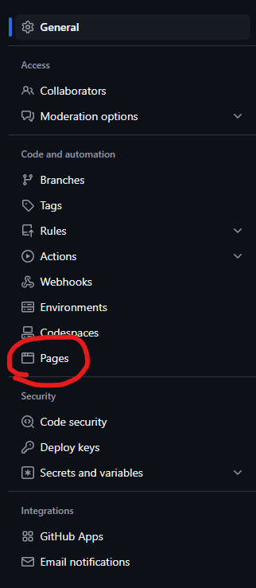
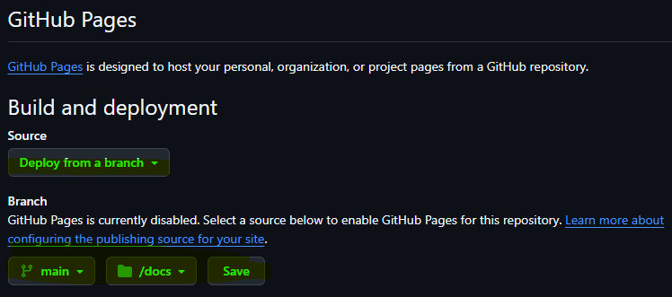
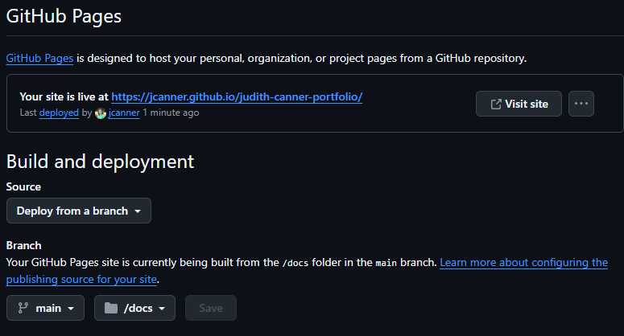
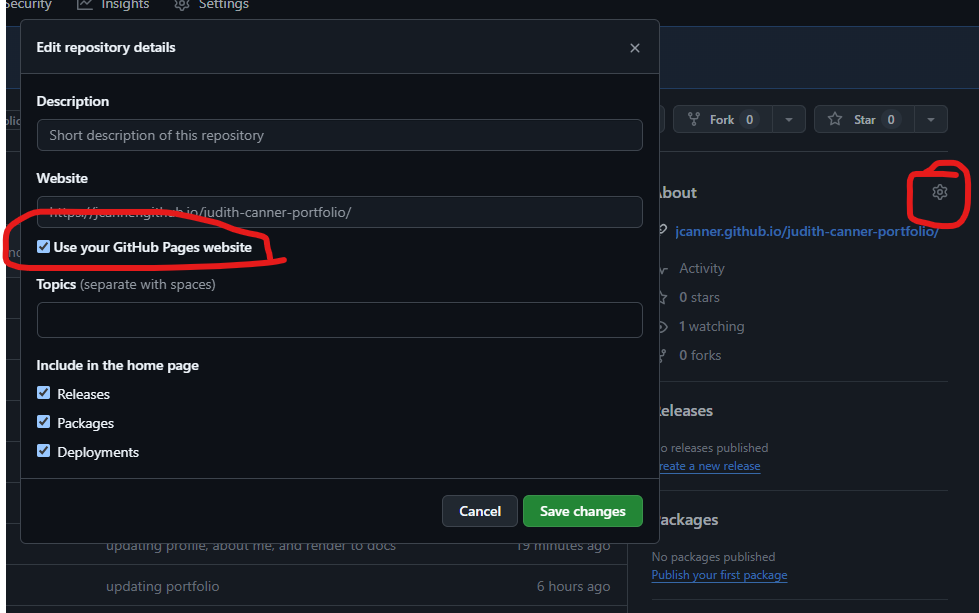

```{r}
#| label: setup
#| include: false
library(flair)
```


# Part One: Workflow for Lab Setup

## Step 1: Make a New Project in RStudio
Either under File, or in the top right corner where the current project name is, select

{fig-alt="Screenshot of new project option in RStudio under the project name in RStudio"}  

## Step 2: Choose a New Directory
For this week, you will create a **New Directory**. 


{fig-alt="Image of New Project Wizard with options for New Directory, Existing Director, and Version Control"}


## Step 3: Choose Quarto Website
Instead of `New Project`, choose `Quarto Website`

{fig-alt="Image of New Project Wizard in RStudio where students should select Quarto Website"}


Set up your directory name (it should be `your-name-portfolio` or something similar) and saved in a location that is **NOT** on a cloud service (e.g. iCloud or Google Drive).  Be sure to check `Create a git repository`and `Open in a new session`. Create the Project.

{fig-alt="Image of New Project Wizard in RStudio where students set their directory name"}

Now you have your website!!


## Step 4: Render your Website
In the pane at the top right corner there should be a tab that say `Build`. Under `Build` there is an option to `Render Website`, go ahead an click that and it will render the generic website.  

{fig-alt="Image of top right pane which under Build and Select Render Website"}

Here is roughly what the page will look like.  

{fig-alt="Image of rendered website"}


# Part Two: Connecting to GitHub
You may have realized that you didn't use Version Control to connect this project to a GitHub repository so let's do that.  

It is pretty straightforward. Simply run the following in the `Console`:

```{r}
usethis::use_github()
```

Note, if you didn't select `Create a git repository` when you created the website you may need to run `usethis::use_git()` first.  It is possible it will ask you to make Commits. Go ahead an commit your changes (but don't push) and then run the code above again. The above code should generate a repository and push the website contents to GitHub.

{fig-alt="Output from using usethis::use_github()"}

# Part Three: Customizing Your Webpage

## About  
Let's start easy. Go into your `about.qmd` and write a short paragraph introducing yourself. Now is a good time to save your changes then **Stage, Commit, and Push** your changes to GitHub.

## Index
The `index.qmd` will serve as your home page for your website, so let's make it pretty!  

- Update the `YAML` code with the following and then update `title`.   
- Move a nice profile image into your project folder and change the file name after `image:` to match your images name and type (e.g. .jpg, .png).    
- Update the LinkedIn and Github links to match your profile links (if you don't have LinkedIn make one!).  

``` markdown
---
title: "Judith Canner"
about:
  template: jolla
  image: jec-profile.jpg
  links:
    - icon: linkedin
      text: LinkedIn
      href: https://www.linkedin.com/in/judith-canner/
    - icon: github
      text: Github
      href: https://github.com/jcanner
---
```

Go ahead and save and then under Build, Render the website.  How does it look?


Within the text/markdown area of the `.qmd` add some of the following information about yourself:  

``` markdown
Judith Canner is a Professor of Statistics and Chair of the Department of Mathematics and Statistics at [California State University, Monterey Bay](http://csumb.edu/mathstat).

## Education

Shippensburg University | Shippensburg, PA  
B.S. in Applied Mathematics | 2001 - 2004

## Experience

Wengo Analytics | Head Data Scientist | April 2018 - present

GeoScynce | Chief Analyst | Sept 2012 - April 2018

```


Go ahead and save and then under Build, Render the website. Now is a good time to save your changes then **Stage, Commit, and Push** your changes to GitHub.

Feel free to make other changes, add additional text, links, or images.

## `_quarto.yml`
Open up the `_quarto.yml`. This document controls the structure of your webpage. You do not put content here, you simply put information about how the website should render.  Your text might look something like this (and if it doesn't, update it to look like this):

``` markdown
project:
  type: website

website:
  title: "Your Name's ePortfolio"
  navbar:
    left:
      - href: index.qmd
        text: "Home"
      - href: about.qmd
        text: "About Me"

format:
  html:
    theme: cosmo
    css: styles.css
    toc: true

editor: source
```
You can update the theme if you want - [Quarto HTML Theming](https://quarto.org/docs/output-formats/html-themes.html) or customize your theme or even create your own css code (if you know how). That is up to you!

At minimum, here is the modification you need to make the following modification - add the `output-dir: docs` at the top under project/type.  


``` markdown
project:
  type: website
  output-dir: docs
```

What this does is renders the HTML parts of your website directly into a folder called `/docs` and this locations is what we will use to publish your webpage on GitHub.

Save your changes. Build your website (notice a `docs` file is now created. Now is a good time to save your changes then **Stage, Commit, and Push** your changes to GitHub


# Part Four: Publish Your Webpage
Ok, here is the final step! You only need to do this once and then after that, every time you push your changes to GitHub it will update your website.

On GitHub, within your repository, go to Settings:


{fig-alt="Location of Settings within GitHub Repository"}

{fig-alt="Location of Pages within Settings within GitHub Repository"}


Under "Build and deployment" be sure that "Source" is set to "Deploy from branch".  Then under "Branch" select "main" instead of "None" and "/docs" instead of "/(root)". Then click "Save"

{fig-alt="Settings to Deploy from the docs file on the main branch for your pages"}

Now give it a minute or two. Then refresh your page and you should see the following information:

{fig-alt="Appearance of website link on pages"}

Now go ahead and visit your site!  

Last step, go back to your repository on GitHub and in the "About" section on the right, then click the gear symbol and set the website to "Use your GitHub Pages website"

{fig-alt="Appearance of website link on pages"}


**Submit a link to your Repository for your Lab 2 Assignment in Canvas.**


# Learn More
If you want to learn more of the "nitty-gritty" of website development in quarto, you can check out their [Guide to Websites](https://quarto.org/docs/websites/) (select `RStudio`) as your tool).  

