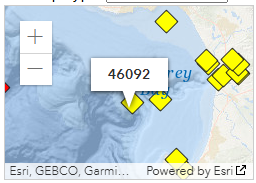

# Part 1: Setup

## GitHub Workflow

We will use GitHub Classroom to submit Lab 3.

### Step 1: Access GitHub Classroom Assignment  

Click on the following link to create your repository for [Lab 4: Importing NOA Buoy Data](https://classroom.github.com/a/gdvyusip).  


::: {.callout-warning} 
## Accept Assignment Invitation
You will need to accept the assignment invitation by clicking the link sent to your email account associated with your GitHub account and then go to the link provided for the repository. Otherwise it will say you do not have access.
:::


### Step 2: Copy the HTTPS Link to the Repository

Find the **<> Code** button and select **Local** and then **HTTPS**. Copy the URL for the Repository provided

{fig-alt="screenshot of GitHub Repository HTTPS link found under CODE in a repository on GitHub"}  


### Step 3: Make a New Project in RStudio
Either under File, or in the top right corner where the current project name is, select

{fig-alt="Screenshot of new project option in RStudio under the project name in RStudio"}  


### Step 4: Choose New Project
For now, we are simply creating a New R Project. This will generate a .Rproj file and folder of the same name to store all of our content and set our working directory. 

{fig-alt="Image of New Project Wizard in RStudio where students should select New Project"}


### Step 5: Choose a Version Control
Choose **Version Control** and then **Git**. Then paste the HTTPS link to the GitHub repository into the spot for Repository URL. Be sure to check that you are saving the project in the correct sub-directory on your computer. **Do Not Change File Name** - it should match the repository name.

{fig-alt="Clone Git Repository Screen in RStudio where you paste the link under Repository URL."}

Now you should be set up and ready to go!


### Step 6: Add Files to your Project
Download the lab and data files linked below into your local project folder. Your project folder should contain the following:  

-  .Rproj
-  [lab-4-student.qmd](../student/lab-4-student.qmd)
-  "data-raw" folder containing
    + `buoy_update.csv` (created by you)
-  "data-clean" folder that will contain only final data set
    + `buoy_final.csv` (created by you)
-  rendered document at github doc

After that is set up, commit and push your added files to your repository. You will submit a link to your GitHub repository with all content. Be sure to push your changes regularly so that you can back up and save your changes. 

## Seeking Help

Part of learning to program is learning from a variety of resources. Thus, I expect you will use resources that you find on the internet. There is, however, an important balance between copying someone else's code and *using their code to learn*. Therefore, if you use external resources, I want to know about it.

-   If you used Google, you are expected to "inform" me of any resources you used by **pasting the link to the resource in a code comment next to where you used that resource**.

-   If you used ChatGPT, you are expected to "inform" me of the assistance you received by (1) indicating somewhere in the problem that you used ChatGPT (e.g., below the question prompt or as a code comment), and (2) downloading and including the `.txt` file containing your **entire** conversation with ChatGPT in your repository. ChatGPT can we used as a "search engine", but you should not copy and paste prompts from the lab or the code into your lab.

Additionally, you are permitted and encouraged to work with your peers as you complete lab assignments, but **you are expected to do your own work**. Copying from each other is cheating, and letting people copy from you is also cheating. Please don't do either of those things.

## Lab Instructions

The questions in this lab are noted with numbers and boldface. Each question will require you to produce code, whether it is one line or multiple lines.

This document is quite plain, meaning it does not have any special formatting. As part of your demonstration of creating professional looking Quarto documents, **I would encourage you to spice your documents up (e.g., declaring execution options, specifying how your figures should be output, formatting your code output, etc.).**

## Setup

Create a `setup` code chunk and load in the packages necessary for your analysis. You should only need the `tidyverse` package for this analysis. Be sure to add `include: false` to the code chunk to hide unnecessary output. 

```{r}
#| label: setup
#| include: false
library(tidyverse)
```

# Part 2: Data Context

Throughout the Monterey Bay there are various NOAA stations that capture data on wind speed, wave height, air temperature and many other data points. Data such as this can be used to predict weather or tidal event or used in conjunction with other data, such as population estimates of sardines or whale migration, to understand the ocean ecosystem.

::::: {layout="[ 70, 30 ]"}
::: {#first-column}
For this lab, we will focus on [Station 46092](https://www.ndbc.noaa.gov/station_history.php?station=46092), which is maintained by MBARI (Monterey Bay Aquarium Research Institute). which is on the outer edge of the Monterey Bay Canyon. Data is collected and stored hourly, but sometimes there are issues with censors not working or other events that lead to missing data.
:::

::: {#second-column}
{fig-alt="A topographical map of the Monterey Bay, CA region with the buoy 46092 indicated near the Monterey Bay Cayon outer edge."}
:::
:::::

We will be looking at a historical file from 2025 to examine air temperature trends over the last year. Historical files have gone through post-processing analysis and represent the data sent to the archive centers. The formats for both are generally the same, with the major difference being the treatment of missing data. Missing data in the Historical files are variable number of 9's, depending on the data type (for example: 999.0 99.0).

In addition, the data file also stores a "comment" in the second row that contains the units measured for each variable. Read more about the [variables stored in the historical files here](https://www.ndbc.noaa.gov/faq/measdes.shtml)

Finally, notice that the data storage type is `txt` which means we cannot use `read_csv()` to import the data. Instead

## Step 1: Reading the Data into `R`
Read the data into R. Since it is a `txt` file it is considered a "whitespace-separated file".  Use the (readr)[https://readr.tidyverse.org/index.html] website to determine the appropriate `read_XXX()` function.  

When you read in the data give it an appropriate name for what the data represents. The read in file should look like this (note this is just the first seven columns):  

```{r}
#| label: load-data
#| echo: false
#| message: false
buoy <- read_table("https://www.ndbc.noaa.gov/view_text_file.php?filename=46092h2025.txt.gz&dir=data/historical/stdmet/")
head(buoy, 10)[,1:7]
```

Notice that the data is all read in as a character value and the first row contains information that is not data, but additional information about the variables: this is called a "comment" in the data.  

## Step 2: Specify the Comment Row  
In your data, you will notice the `#` in front of `yr` in the second row. That is the symbol that indicates a comment in the data set. Notice that the first row of headers also starts with a `#`, so we have to be clever here so R doesn't remove both rows.

Using the cheatsheet or the (readr)[https://readr.tidyverse.org/index.html] website, add an argument to your function that indicates that the comment row begins with `#y`.  Your data should now look like this:

```{r}
#| label: load-data-comment
#| echo: false
#| message: false
library(tidyverse)
buoy2 <- read_table("https://www.ndbc.noaa.gov/view_text_file.php?filename=46092h2025.txt.gz&dir=data/historical/stdmet/",
                   comment = "#y")
head(buoy2, 10)[,1:7]
```


## Step 3: Clean the Variable Names  
We want to use snake_case for our variable names. Use the `janitor` package to clean the variable names. Notice, that because month was originally coded `MM` and minute was originally coded `mm` that now month is `mm` and minute is `mm_2` to create a distinction between them.  

```{r}
#| label: clean-names
#| echo: false

buoy3 <- janitor::clean_names(buoy2)
head(buoy3)[,1:5]
```

## Step 4: Write the Data Part 1
We will have a bit of cleaning to do on the data, but we have an issue. The 99 and 999's in the data are numeric and not character values. In order for us to specify them as `NA`s we need to do a little work around.  

Write the data to a `csv` file called `buoy_update.csv`. Be sure to write it to your `data-raw` folder.  

```{r}
#| label: write-data-part-1
#| echo: false

write_csv(buoy3, "../student/data/buoy_update.csv")
```


## Step 5: Dealing with Missing Values  
Now we will read the data back in, be sure to assign the it a meaningful object name, **BUT** we are going to do two things:  

1. Specify all column type *defaults* as character.  
2. Specify `NA`s as "99" and "999"

Remember that now we are reading back in a data file of type `csv`. Now when you look at the data we should have `NA` instead of `99` or `999` in our data, for example:

```{r}
#| label: load-data-again
#| echo: false
#| message: false
your_file_name <- read_csv("../student/data/buoy_update.csv",
                           col_types = cols(.default = col_character()),
                          na = c("99", "999", "9999"))
head(your_file_name, 5)[,10:13]
```

This is great! But we created another problem. Now all of our numeric values are being treated like characters and we don't want that. There are a couple of ways to fix this. We can write and reread in the data setting the column types to `double` or we can use the `readr` parsing functions. 

Here is the code you can use to fix the data without exporting and importing again (we will learn more about the `mutate()` function. Insert whatever you called your buoy data on the last import for `your_file_name`.  

```{r}
#| label: parse-double
#| echo: true
buoy_final <- your_file_name |> 
  mutate(across(.cols = everything(), ~parse_double(.x)))
```


Now we have our clean, correctly classified, data ready for analysis as `buoy_final`. Go ahead and write that data as a `csv` file into your `data-clean` file. Once you've done that. Set the data cleaning code chunks to `eval: false` so that you do not rerun them again when you render the document. 


# Part 3: Recreate the Following Visualization
Now that are data is "analytic ready", go ahead and read in your clean data and use it to try and recreate the following visualization. Do your best to match the following visualization as close as possible. (Hint: when specifying color, you may need to use `factor()` to get R to treat a continuous value as discrete).  

```{r}
#| label: monterey-air-temp-viz
#| echo: false
#| warning: false
#| message: false

buoy_final |> 
  ggplot(mapping = aes(y = atmp, x = mm)) +
  geom_jitter(aes(color = factor(mm)), alpha = 0.1, width = 0.1) +
  geom_smooth(color = "black") + 
  guides(color = "none") +
  scale_color_viridis_d() + 
  theme_light() +
  scale_x_continuous(breaks = c(1:12)) +
  labs(x = "Month in 2025",
       y = "Air Temperature (Celsius)",
       title = "Monterey Bay Caynon Air Temperature in 2025",
       caption = "Source: NOAA National Data Buoy Center")

```

# Part 4: Find a Data Set

For your final portfolio, you will choose a data set to clean and provide an analysis of through visualization (or more if you have the experience). For this week, choose a data set

-   It is a real-world application of R that has not exactly been worked out before (e.g. it isn't a demo from some package or blog).\
-   It is interesting to you.\
-   It involves data and analyzing or presenting that data. The data may be data you have from a lab, or something you have retrieved from the web, some examples of good sources: FBI database on crime statistics, National Oceanic and Atmospheric Administration, World Health Organization, Twitter, Yahoo finance data, etc. If you are having problems finding a dataset, see the resources at the end of the project description.\
-   The analysis and presentation is useful in the real-world.

One fun source for data is [Tidy Tuesday](https://github.com/rfordatascience/tidytuesday) which posts a new data set almost every week. It is a great place to find ideas and sources.

**For your found data write a brief description of the data and and provide its source.**

# Lab 4 Submission

For Lab 4 you will submit the link to your GitHub repository. Your rendered file is required to have the following specifications in the YAML options (at the top of your document):

-   have the plots embedded (`embed-resources: true`)
-   include your source code (`code-tools: true`)
-   include all your code and output (`echo: true`)

**If any of the options are not included, your Lab 4 assignment will receive an "Incomplete" and you will be required to submit a revision.**

In addition, your document should not have any warnings or messages output in your document. **If your contains warnings or messages, you will receive an "Incomplete" for document formatting and you will be required to submit a revision.**