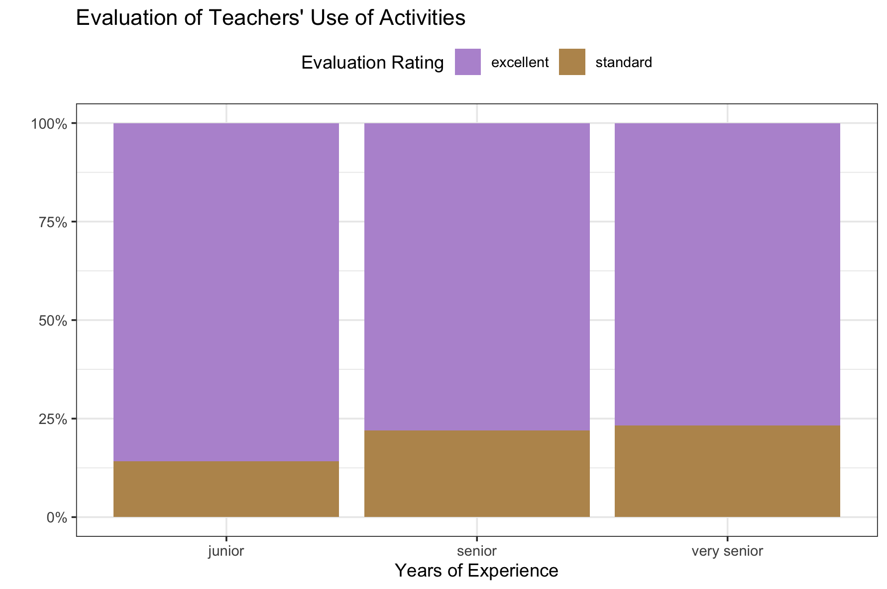

<!-- https://github.com/michaelpt071/Lab-5_Student-Evals -->

In this lab, we will be using the `dplyr` package to explore student evaluations of teaching data. **You are expected to use functions from `dplyr` to do your data manipulation!**

# Part 1: Setup

## GitHub Workflow

We will use GitHub Classroom to submit Lab 5.

### Step 1: Access GitHub Classroom Assignment  

Click on the following link to create your repository for [Lab 5: Student Evaluations of Teaching](https://classroom.github.com/a/8p04MCiv).  


::: {.callout-warning} 
## Accept Assignment Invitation
You will need to accept the assignment invitation by clicking the link sent to your email account associated with your GitHub account and then go to the link provided for the repository. Otherwise it will say you do not have access.
:::


### Step 2: Copy the HTTPS Link to the Repository

Find the **<> Code** button and select **Local** and then **HTTPS**. Copy the URL for the Repository provided

{fig-alt="screenshot of GitHub Repository HTTPS link found under CODE in a repository on GitHub"}  


### Step 3: Make a New Project in RStudio
Either under File, or in the top right corner where the current project name is, select

{fig-alt="Screenshot of new project option in RStudio under the project name in RStudio"}  


### Step 4: Choose New Project
For now, we are simply creating a New R Project. This will generate a .Rproj file and folder of the same name to store all of our content and set our working directory. 

{fig-alt="Image of New Project Wizard in RStudio where students should select New Project"}


### Step 5: Choose a Version Control
Choose **Version Control** and then **Git**. Then paste the HTTPS link to the GitHub repository into the spot for Repository URL. Be sure to check that you are saving the project in the correct sub-directory on your computer. **Do Not Change File Name** - it should match the repository name.

{fig-alt="Clone Git Repository Screen in RStudio where you paste the link under Repository URL."}

Now you should be set up and ready to go!


### Step 6: Add Files to your Project
Be sure to set up a GitHub repository and then use Version Control to set up your Lab 5 R Project so it is connected. Then download this week's lab file into the folder and create a `data-raw` and `data-clean` folder and store the provided data appropriately:

+ [lab-5-student.qmd](../student/lab-5-student.qmd) 
+ data-raw
    - [teacher_evals.csv](../student/data/teacher_evals.csv)
+ data-clean (you will want to save your clean data data in this folder)

You will also want to look at the [**Teacher Evaluations Codebook**](../student/resources/teacher_evals_codebook.pdf) to help you understand the variables and data.  


::: {.callout-important}
Now is a good time to commit and push your changes before you start making more edits to the lab file.
:::


# Part 2: Some Words of Advice

Part of learning to program is learning from a variety of resources. Thus, I expect you will use resources that you find on the internet. There is, however, an important balance between copying someone else's code and *using their code to learn*. Therefore, if you use external resources, I want to know about it.

-   If you used Google, you are expected to "inform" me of any resources you used by **pasting the link to the resource in a code comment next to where you used that resource**.

-   If you used ChatGPT, you are expected to "inform" me of the assistance you received by (1) indicating somewhere in the problem that you used ChatGPT (e.g., below the question prompt or as a code comment), and (2) downloading and including the `.txt` file containing your **entire** conversation with ChatGPT in your repository.

Additionally, you are permitted and encouraged to work with your peers as you complete lab assignments, but **you are expected to do your own work**. Copying from each other is cheating, and letting people copy from you is also cheating. Please don't do either of those things.

## Setting Up Your Code Chunks

-   The first chunk of your Quarto document should be to *declare your libraries* (probably only `tidyverse` for now).
-   The second chunk of your Quarto document should be to *load in your data*.

## Save Regularly, Render Often

-   Be sure to **save** your work regularly.
-   Be sure to **render** your file every so often, to check for errors and make sure it looks nice.
    -   Make sure your Quarto document does not contain `View(dataset)` or `install.packages("package")`, both of these will prevent rendering.
    -   Check your Quarto document for occasions when you looked at the data by typing the name of the data frame. Leaving these in means the whole dataset will print out and this looks unprofessional. **Remove these!**
    -   If all else fails, you can set your execution options to `error: true`, which will allow the file to render even if errors are present.
    
    
    
::: {.callout-important}    
Be sure you follow all style guide formatting as well as labelling code chunks and adding informative comments to your code.  

:::

# Part 3: Let's Start Working with the Data!

## The Data

The `teacher_evals` dataset contains student evaluations of reaching (SET) collected from students at a University in Poland. There are SET surveys from students in all fields and all levels of study offered by the university. [^1]

[^1]: Citation: journal, Under blind review in refereed. *University SET data, with faculty and courses characteristics.* Ann Arbor, MI: Inter-university Consortium for Political and Social Research \[distributor\], 2021-09-12. <https://doi.org/10.3886/E149801V1>

The SET questionnaire that every student at this university completes is as follows:

> Evaluation survey of the teaching staff of University of Poland. Please complete the following evaluation form, which aims to assess the lecturer’s performance. Only one answer should be indicated for each question. The answers are coded in the following way: 5 - I strongly agree; 4 - I agree; 3 - Neutral; 2 - I don’t agree; 1 - I strongly don’t agree.
>
> Question 1: I learned a lot during the course.
>
> Question 2: I think that the knowledge acquired during the course is very useful.
>
> Question 3: The professor used activities to make the class more engaging.
>
> Question 4: If it was possible, I would enroll for a course conducted by this lecturer again.
>
> Question 5: The classes started on time.
>
> Question 6: The lecturer always used time efficiently.
>
> Question 7: The lecturer delivered the class content in an understandable and efficient way.
>
> Question 8: The lecturer was available when we had doubts.
>
> Question 9. The lecturer treated all students equally regardless of their race, background and ethnicity.

These data are from the end of the winter semester of the 2020-2021 academic year. In the period of data collection, all university classes were entirely online amid the COVID-19 pandemic. While expected learning outcomes were not changed, the online mode of study could have affected grading policies and could have implications for data.

**Average SET scores** were combined with many other variables, including:

1.  **characteristics of the teacher** (degree, seniority, gender, SET scores in the past 6 semesters).
2.  **characteristics of the course** (time of day, day of the week, course type, course breadth, class duration, class size).
3.  **percentage of students providing SET feedback.**
4.  **course grades** (mean, standard deviation, percentage failed for the current course and previous 6 semesters).

This rich dataset allows us to **investigate many of the biases in student evaluations of teaching** that have been reported in the literature and to formulate new hypotheses.

Before tackling the problems below, study the description of each variable included in the `teacher_evals_codebook.pdf`.

**1. Load the appropriate R packages for your analysis.**

```{r}
#| label: setup
# code chunk for loading packages

```

```{r}
#| label: setup-solution
#| echo: false
# code chunk for loading packages
library(tidyverse)
```


**2. Load in the `teacher_evals` data.** 

```{r}
#| label: load-data
# code chunk for importing the data

```


```{r}
#| label: load-data-solution
#| echo: false
# code chunk for importing the data
teacher_evals <- read_csv("data/teacher_evals.csv", show_col_types = FALSE)
```


### Data Inspection + Summary

**3. Provide a brief overview (\~4 sentences) of the dataset.**

::: callout-note
It is always good practice to start an analysis by getting a feel for the data 
and providing a quick summary for readers. You do not need to show any code for
this question, although you probably want to use code to get some information
about the data (e.g., `summary(data)`, `glimpse(data)`, `dim(data)`, etc.).
Things to think about – where did the data come from? what sort of data are
provided (context and data type)? how much data do you have? etc.
:::

```{r}
#| label: explore-data
# you may want to use code to answer this question

```


```{r}
#| label: explore-data-solution
#| echo: false
# you may want to use code to answer this question
glimpse(teacher_evals)
```

<!-- > The dataset is from surveys of students who attend a university in Poland. It is made of average teacher evaluation scores from those students for particular questions, as well as general characteristics of each class and teacher being evaluated. There are 22 variables and 8015 rows.-->


**4. What is the unit of observation (i.e. a single row in the dataset) identified by?**

::: callout-warning
It is not one instructor per row! It’s also not just one class per row!
:::

```{r}
#| label: row-identification
# you may want to use code to answer this question
```


<!-- >Each row is a specific question associated with a specific course/instructor from the evaluation -->


**5. Use _one_ `dplyr` pipeline to clean the data by:**

- **renaming the `gender` variable `sex`**
- **removing all courses with fewer than 10 respondents**
- **changing data types in whichever way you see fit (e.g., is the instructor ID
really a numeric data type?)**
- **only keeping the columns we will use -- `course_id`, `teacher_id`,
`question_no`, `no_participants`, `resp_share`, `SET_score_avg`,
`percent_failed_cur`, `academic_degree`, `seniority`, and `sex`**

**Assign your cleaned data to a new variable named `teacher_evals_clean` –- use these data going forward. Save the data as `teacher_evals_clean.csv` in the `data-clean` folder.**

::: callout-tip
Helpful functions: `rename()`, `mutate()`, `as.factor()`

It would be most efficient to use `across()` in combination with `mutate()` to
complete this task.
:::

```{r}
#| label: data-cleaning
# code chunk for Q5

```

```{r}
#| label: data-cleaning-solution
#| echo: false
# code chunk for Q5
teacher_evals_clean <- teacher_evals |>  
  rename(sex = gender) |> 
  filter(no_participants >= 10) |> 
  mutate(teacher_id = as.character(teacher_id)) |> 
  select(course_id, 
         teacher_id, 
         question_no, 
         no_participants, 
         resp_share, 
         SET_score_avg, 
         percent_failed_cur, 
         academic_degree, 
         seniority, 
         sex)

#write_csv(teacher_evals_clean, "data-clean/teacher_evals_clean.csv")
```


**6. How many unique instructors and unique courses are present in the cleaned dataset?**

::: callout-tip
Helpful functions: `summarize()`, `n_distinct()`
:::

```{r}
#| label: unique-courses
# code chunk for Q6

```

```{r}
#| label: unique-courses-solution
#| echo: false
# code chunk for Q6
teacher_evals_clean |> 
  summarize(n_teachers = n_distinct(teacher_id),
            n_courses = n_distinct(course_id))
```


**7. One teacher-course combination has some missing values, coded as `NA`. Which instructor has these missing values? Which course? What variable are the missing values in?**

::: callout-tip
Helpful functions: `filter()`, `if_any()`, `everything()`

`if_any()` works similar to `across()` but within `filter()`. The structure is  
`filter(if_any(variable, ~function(.)))`
:::

```{r}
#| label: uncovering-missing-values
# code chunk for Q7

```

```{r}
#| label: uncovering-missing-values-solution
#| echo: false
# code chunk for Q7
teacher_evals_clean |> 
  filter(if_any(everything(), ~is.na(.)))

teacher_evals_clean |>  
  filter_all(any_vars(is.na(.)))
```


**8. What are the demographics of the instructors in this study? Investigate the variables `academic_degree`, `seniority`, and `sex` and summarize your findings in \~3 complete sentences.**

::: callout-tip
You’ll need to first wrangle your data to have each instructor represented only once.

Helpful functions: `select()`, `distinct(___, .keep_all = TRUE)`, `count()`, `summarize()`
:::

```{r}
#| label: exploring-demographics-of-instructors
# code chunk for Q8


```

```{r}
#| label: exploring-demographics-of-instructors-solutions
#| echo: false
# code chunk for Q8

teacher_evals_clean |> 
  select(teacher_id, sex, academic_degree, seniority) |> 
  distinct(teacher_id, .keep_all = TRUE) |> 
  count(sex, academic_degree, seniority) |> 
  group_by(sex, academic_degree) |> 
  summarize(avg_seniority = mean(seniority, weight = n),
            .groups = "drop_last") |> 
  pivot_wider(names_from = academic_degree, values_from = avg_seniority) |> #did not learn this yet
  select(sex, no_dgr, ma, prof, dr)
```

<!-- > females with professional degrees have lower avg years seniority compared to males. Similar levels for ma and dr. no_drg have lower levels of seniority -->


**9. Each course seems to have used a different subset of the nine evaluation questions. How many teacher-course combinations asked all nine questions?**

::: callout-tip
You’ll need to first wrangle your data to find the number of questions asked 
within each teacher-course combination. Then there are several ways to determine
the number that used all 9 questions.

Helpful functions: `group_by()`, `n_distinct()`, `count()`, `summarize()`, `ungroup()`

:::

```{r}
#| label: teacher-course-asked-every-question
# code chunk for Q9


```


```{r}
#| label: teacher-course-asked-every-question-solutions
#| echo: false
# code chunk for Q9
teacher_evals_clean |> 
  count(course_id, teacher_id) |> 
  filter(n == 9) |> 
  nrow()

teacher_evals_clean |> 
  group_by(course_id, teacher_id) |> 
  summarize(n = n(), .groups = "drop_last") |> 
  ungroup() |> 
  filter(n == 9) |> 
  nrow()

```


## Rate my Professor

::: callout-tip
Helpful functions: `filter()`, `group_by()`, `summarize()`, `slice()`

Useful variables: `question_no`, `teacher_id`, `SET_score_avg`, `percent_failed_cur`, `resp_share`, `academic_degree`, `seniority`, `sex`
:::

**10. Which instructors had the highest and lowest average rating for Question 1 (I learned a lot during the course.) across all their courses?**

```{r}
#| label: question-1-high-low
# code chunk for Q10

```


```{r}
#| label: question-1-high-low-solution
#| echo: false
# code chunk for Q10

teacher_evals_clean |> 
  filter(question_no == 901) |> 
  group_by(teacher_id) |> 
  summarize(avg_score_901 = mean(SET_score_avg), 
            .groups = "drop_last") |> 
  #ungroup() |> 
  filter(avg_score_901 == min(avg_score_901) | 
           avg_score_901 == max(avg_score_901)) |> 
  arrange(avg_score_901)
  
```


**11. Which instructors with one year of experience had the highest and lowest average percentage of students failing in the current semester across all their courses?**

```{r}
#| label: one-year-experience-failing-students
# code chunk for Q11

```


```{r}
#| label: one-year-experience-failing-students-solutions
#| echo: false
# code chunk for Q11

teacher_evals_clean |> 
  filter(seniority == 1) |> 
  group_by(teacher_id) |> 
  summarize(avg_fail = mean(percent_failed_cur), .groups = "drop_last") |>
  ungroup() |> 
  filter(avg_fail %in% c(min(avg_fail), max(avg_fail))) |> 
  arrange(avg_fail)


```


**12. Which female instructors with either a doctorate or professional degree had the highest and lowest average percent of students responding to the evaluation across all their courses?**

```{r}
#| label: female-instructor-student-response
# code chunk for Q12

```


```{r}
#| label: female-instructor-student-response-solutions
#| echo: false
# code chunk for Q12
teacher_evals_clean |> 
  filter(sex == "female",
         academic_degree %in% c("dr", "prof")) |> 
  group_by(teacher_id, academic_degree) |> 
  summarize(avg_percent_response = mean(resp_share), .groups = "drop_last") |>
  ungroup() |> 
  filter(avg_percent_response == min(avg_percent_response) | 
           avg_percent_response == max(avg_percent_response)) |> 
  arrange(avg_percent_response)
```


# Lab 5 Submission

For Lab 5 you will submit the link to your GitHub repository. Your rendered file is required to have the following specifications in the YAML options (at the top of your document):

-   include your source code (`code-tools: true`)
-   include all your code and output (`echo: true`)

**If any of the options are not included, your Lab 5 assignment will receive an "Incomplete" and you will be required to submit a revision.**

In addition, your document should not have any warnings or messages output in your document. **If your contains warnings or messages, you will receive an "Incomplete" for document formatting and you will be required to submit a revision.**


# Challenge Instructions
Remember, challenges are not required, but they are encouraged. This challenge builds on the work you already did with the data on teacher evaluations. Specifically, you are tasked with recreating a plot, carrying out a Chi-Squared test of Independence, and providing a critique of the design and collection of these data.

## Accessing the Challenge

Download the template Challenge 5 Quarto file here: <a href="../student/challenge-5-student.qmd" download>`challenge-5-student.qmd`</a>

::: callout-important
Be sure to save the file in the Lab 3 folder, inside your Week 3 folder, inside your STAT 331 folder!
:::

## Chi-Square Test of Independence

::: callout-tip
## Refresher on Chi-square test of Independence

In case it has been a second or two since you did a Chi-Squared test, [this chapter](https://openintro-ims.netlify.app/inference-tables#inference-tables) provides a friendly refresher.
:::

Let’s compare the level of SET ratings for Question 3 (The professor used activities to make the class more engaging.) between senior instructors and junior instructors.

**1. Using the original `teacher_evals` dataset (not `teacher_evals_clean`), create a new dataset that accomplishes the following with *one*`dplyr` pipeline:**

-   **includes responses for Question 3 only**
-   **creates a new variable called set_level that is "excellent" if the SET_score_avg is 4 or higher (inclusive) and "standard" otherwise**
-   **creates a new variable called sen_level that is "junior'”' if the instructor has been teaching for 4 years or less (inclusive), "senior" if between 5-8 years (inclusive), and "very senior" if more than 8 years**
-   **contains only the variables we are interested in –- `course_id`, `SET_level`, and `sen_level`**
-   **saves the mutated data into a new data frame named `teacher_evals_compare`**

::: callout-tip
Helpful functions: `filter()`, `mutate()`, `if_else()`, `select()`
:::

```{r}
#| label: cleaning-data-for-junior-senior-comparison

```

**2. Using the new dataset and your `ggplot2` skills, recreate the bar plot shown below.**



::: callout-tip
You [should not]{.underline} have to do any more data manipulation to create this plot.

Helpful geometric object and arguments: `geom_bar(stat = ..., position = ...)`

Note that getting the general structure and reader friendly labels is the first step. Next, you need to move the legend from the right hand side of the plot to the top. Next, you get to match the colors and theme of the plot. The final step is to get the percentage labels on the y-axis.
:::

```{r}
#| label: recreate-plot

```

**3. Look up the documentation for `chisq.test()` to carry out a chi-square test of independence between the SET level and instructor seniority level in your new dataset.**

::: callout-tip
Note that the `chisq.test()` function does not take a formula / data specification like we saw in Lab 2 with `t.test()`. This function requires you to extract the variables you wish to include in the analysis using a `$` (e.g., `evals$level`).
:::

```{r}
#| label: chi-square-test

```

**4. Draw a conclusion about the independence of evaluation level and seniority level based on your chi-square test.**

## Study Critique

Part of the impetus behind this study was to investigate characteristics of a course or an instructor that might affect student evaluations of teaching that are **not** explicitly related to teaching effectiveness. For instance, it has been shown that gender identity and gender express affect student evaluations of teaching ([an example](https://link.springer.com/article/10.1007/s10755-014-9313-4?nr_email_referer=1)).

**5. If you were to conduct this study at Cal Poly, what are two other variables you would like to collect that you think might be related to student evaluations? These should be course or instructor characteristics that [were not]{.underline} collected in this study.**

**6. Explain what effects / relationships you would expect to see for each of the two variables you outlined.**
