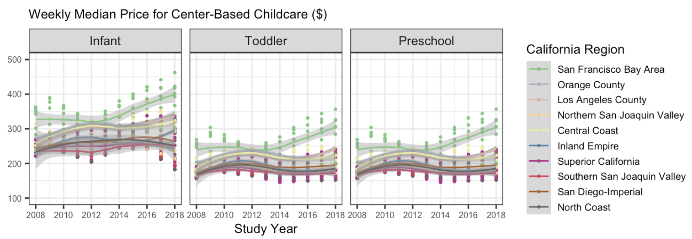

# Part One: Set-up

In this lab, we will be using the **tidyr** and **forcats** packages to explore
the cost of childcare across the US. **You are expected to use functions from tidyr and forcats to do your data manipulation!**

# Part 1: Setup

## GitHub Workflow

We will use GitHub Classroom to submit Lab 6.

### Step 1: Access GitHub Classroom Assignment  

Click on the following link to create your repository for [Lab 6: Childcare Costs in California](https://classroom.github.com/a/7FpNeWYV).  


::: {.callout-warning} 
## Accept Assignment Invitation
You will need to accept the assignment invitation by clicking the link sent to your email account associated with your GitHub account and then go to the link provided for the repository. Otherwise it will say you do not have access.
:::


### Step 2: Copy the HTTPS Link to the Repository

Find the **<> Code** button and select **Local** and then **HTTPS**. Copy the URL for the Repository provided

{fig-alt="screenshot of GitHub Repository HTTPS link found under CODE in a repository on GitHub"}  


### Step 3: Make a New Project in RStudio
Either under File, or in the top right corner where the current project name is, select

{fig-alt="Screenshot of new project option in RStudio under the project name in RStudio"}  


### Step 4: Choose New Project
For now, we are simply creating a New R Project. This will generate a .Rproj file and folder of the same name to store all of our content and set our working directory. 

{fig-alt="Image of New Project Wizard in RStudio where students should select New Project"}


### Step 5: Choose a Version Control
Choose **Version Control** and then **Git**. Then paste the HTTPS link to the GitHub repository into the spot for Repository URL. Be sure to check that you are saving the project in the correct sub-directory on your computer. **Do Not Change File Name** - it should match the repository name.

{fig-alt="Clone Git Repository Screen in RStudio where you paste the link under Repository URL."}

Now you should be set up and ready to go!


### Step 6: Add Files to your Project
Be sure to set up a GitHub repository and then use Version Control to set up your Lab 5 R Project so it is connected. Then download this week's lab file into the folder and create a `data-raw` and `data-clean` folder and store the provided data appropriately:

+ [lab-6-student.qmd](../student/lab-6-student.qmd) 
+ The data for the lab are coming from [TidyTuesday](https://github.com/rfordatascience/tidytuesday),
so we will load them using a URL (no need to download them). 


::: {.callout-important}
Now is a good time to commit and push your changes before you start making more edits to the lab file.
:::


::: {.callout-tip collapse="true"}
I advise you to focus particularly on:

-   Setting chunk options carefully.

-   Making sure you don't print out more output than you need.

-   Making sure you don't assign more objects than necessary. Avoid "object junk" in your environment.

-   Making your code readable and nicely formatted.

-   Thinking through your desired result **before** writing any code.
:::

# Part Two: Exploring Childcare Costs


## The Data

In this lab we're going look at the median weekly cost of childcare in California. The data come to us from [TidyTuesday](https://github.com/rfordatascience/tidytuesday). A detailed description of the data can be found [here](https://github.com/rfordatascience/tidytuesday/blob/master/data/2023/2023-05-09/readme.md). **You will need to use this data dictionary to complete the lab!**

We also have information from the California State Controller on tax revenue for california counties from 2005 - 2018. I compiled the data from [this website](https://counties.bythenumbers.sco.ca.gov/#!/year/default) for you. Note that there is no data for San Franscisco County. The variables included in the `ca_tax_revenue.csv` data file (loaded below) include:

- `entity_name`: County name
- `year`: fiscal year
- `total_property_taxes`: total revenue in $ from property taxes
- `sales_and_use_taxes`: total revenue in $ from sales and use taxes

**0. Load the appropriate libraries and the data.**

```{r}
#| label: packages

```

```{r}
#| label: load-data

childcare_costs <- read_csv('https://raw.githubusercontent.com/rfordatascience/tidytuesday/master/data/2023/2023-05-09/childcare_costs.csv')

counties <- read_csv('https://raw.githubusercontent.com/rfordatascience/tidytuesday/master/data/2023/2023-05-09/counties.csv')

tax_rev <- read_csv('https://raw.githubusercontent.com/statistical-computing-r/spring-2026/refs/heads/main/labs/instructions/data/ca_tax_revenue.csv')
```

**1. Briefly describe the `childcare_costs` dataset (~ 4 sentences). What information does it contain?**

## California Childcare Costs

**2. Let's start by focusing only on California. Create a `ca_childcare` dataset of childcare costs in California, containing (1) county information and (2) all information from the `childcare_costs` dataset. You should do all of this within one pipeline.** 

```{r}
#| label: ca-childcare-costs

```

::: {.callout-tip}
# Checkpoint 

There are 58 counties in CA and 11 years in the dataset. Therefore, your new
dataset should have 53 x 11 = 638 observations.
:::

**3. Now, lets add the tax revenue information to the `ca_childcare` dataset. Add the data from `tax_rev` for the counties and years that are already in the `ca_childcare` data. Overwrite the old `ca_childcare` data with this dataset.**

```{r}
#| label: add-tax-information

```

::: {.callout-tip}
# Checkpoint 

You are only adding columns here, so your new dataset should still have 638
observations!
:::

**4. Using a function from the `forcats` package, complete the code below to create a new variable where each county is categorized into one of the [ten (10) Census regions](https://census.ca.gov/regions/) in California. Use the Region description (from the plot), not the Region number.** The code below will help you get started.

```{r}
#| label: county-groups
#| code-fold: true

# defining 10 census regions

superior_counties <- c("Butte","Colusa","El Dorado",
                       "Glenn","Lassen","Modoc",
                       "Nevada","Placer","Plumas",
                       "Sacramento","Shasta","Sierra","Siskiyou",
                       "Sutter","Tehama","Yolo","Yuba")

north_coast_counties <- c("Del Norte","Humboldt","Lake",
                          "Mendocino","Napa","Sonoma","Trinity")

san_fran_counties <- c("Alameda","Contra Costa","Marin",
                       "San Francisco","San Mateo","Santa Clara",
                       "Solano")

n_san_joaquin_counties <- c("Alpine","Amador","Calaveras","Madera",
                            "Mariposa","Merced","Mono","San Joaquin",
                            "Stanislaus","Tuolumne")

central_coast_counties <- c("Monterey","San Benito","San Luis Obispo",
                            "Santa Barbara","Santa Cruz","Ventura")

s_san_joaquin_counties <- c("Fresno","Inyo","Kern","Kings","Tulare")

inland_counties <- c("Riverside","San Bernardino")

la_county <- "Los Angeles"

orange_county  <- "Orange"

san_diego_imperial_counties <- c("Imperial","San Diego")
```

```{r}
#| label: recoding-county-to-census-regions
# Finish this code using the census regions defined above

ca_childcare <- ca_childcare |> 
  mutate(county_name = str_remove(county_name, " County")) |>
  mutate(region = fct_______(county_name,
    'Superior California' = c("Butte", "Colusa", "El Dorado",...),
    ...
  )
  
```

::: callout-tip

I have provided you with code that eliminates the word "County" from each of the county names in your `ca_childcare` dataset. You should keep this line of code and pipe into the rest of your data manipulations.

You will learn about the `str_remove()` function from the `stringr` package in Week 11.

:::

**5. Let's consider the median household income of each region, and how that income has changed over time. Create a table with ten rows, one for each region, and two columns, one for 2008 and one for 2018 (plus a column for region). The cells should contain the `median()` of the median household income (expressed in 2018 dollars) of the `region` and the `study_year`. Order the rows by 2018 values from highest income to lowest income.**

::: callout-tip
This will require transforming your data! Sketch out what you want the data to look like before you begin to code. You should be starting with your California dataset that contains the regions!
:::

```{r}
#| label: median-income-by-region-over-time

```


**6. Which California `region` had the lowest `median` full-time median weekly price for center-based childcare for infants in 2018? Does this `region` correspond to the `region` with the lowest `median` income in 2018 that you found in Q4?**

::: callout-warning
The code should give me the EXACT answer. This means having the code output the exact row(s) and variable(s) necessary for providing the solution.
:::

```{r}
#| label: lowest-median-weekly-price-2018

```

**7. The following plot shows, for all ten regions, the change over time of the full-time median price for center-based childcare for infants, toddlers, and preschoolers. Recreate the plot. You do not have to replicate the exact colors or theme, but your plot should have the same content, including the order of the facets and legend, reader-friendly labels, axes breaks, and a loess smoother.**

:::callout-tip
# Hints

This will require transforming your data! Sketch out what you want the data to look like before you begin to code. You should be starting with your California dataset that contains the regions.

A point on the plot represents one county and year.

You should use a `forcats` function to reorder the legend automatically
(not by hand).

Try setting `aspect.ratio = 1` in `theme()` if your plot is squished.

If you need more colors than what a color palette has by default, you can use
the `colorRampPalette()` function to get more colors. 

Again, your plot does not need to look exactly like this one!!!

Remember to avoid "object junk" in your environment!
:::




```{r}
#| label: recreate-plot

```


## There is no Challenge this week! 

Please take this time to try your best to recreate the plot I provided in
Question 7! 

- Can you match my colors? 
- Can you get the legend in the same order?
- Can you get the facet names to match and be in the same order?

Could you even make the plot better? Could you add dollar signs to the y-axis labels? I might suggest you look into the 
[scales package](https://scales.r-lib.org/reference/label_currency.html).

