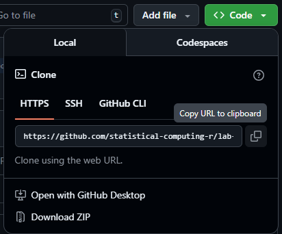
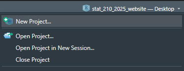
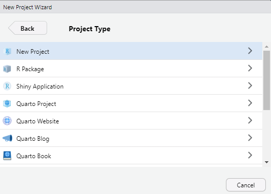
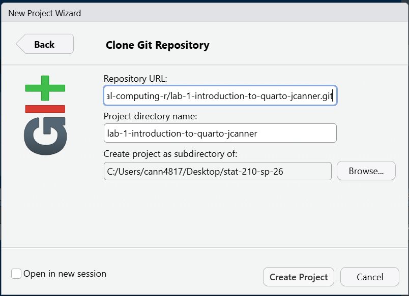

The goal of this lab is learn more about exploring missing data and writing
modular code and functions.


# Part One: Set-up

## GitHub Workflow

We will use GitHub Classroom to submit Lab 8.

### Step 1: Access GitHub Classroom Assignment  

Click on the following link to create your repository for [Lab 8: Functions + Fishes](https://classroom.github.com/a/LNt6lY2P).  


::: {.callout-warning} 
## Accept Assignment Invitation
You will need to accept the assignment invitation by clicking the link sent to your email account associated with your GitHub account and then go to the link provided for the repository. Otherwise it will say you do not have access.
:::


### Step 2: Copy the HTTPS Link to the Repository

Find the **<> Code** button and select **Local** and then **HTTPS**. Copy the URL for the Repository provided

{fig-alt="screenshot of GitHub Repository HTTPS link found under CODE in a repository on GitHub"}  


### Step 3: Make a New Project in RStudio
Either under File, or in the top right corner where the current project name is, select

{fig-alt="Screenshot of new project option in RStudio under the project name in RStudio"}  


### Step 4: Choose New Project
For now, we are simply creating a New R Project. This will generate a .Rproj file and folder of the same name to store all of our content and set our working directory. 

{fig-alt="Image of New Project Wizard in RStudio where students should select New Project"}


### Step 5: Choose a Version Control
Choose **Version Control** and then **Git**. Then paste the HTTPS link to the GitHub repository into the spot for Repository URL. Be sure to check that you are saving the project in the correct sub-directory on your computer. **Do Not Change File Name** - it should match the repository name.

{fig-alt="Clone Git Repository Screen in RStudio where you paste the link under Repository URL."}

Now you should be set up and ready to go!


### Step 6: Add Files to your Project
Be sure to set up a GitHub repository and then use Version Control to set up your Lab R Project so it is connected. Then download this week's lab file into the folder and create a `data-raw` and `data-clean` folder and store the provided data appropriately:

+ [lab-8-student.qmd](../student/lab-8-student.qmd)  
+ [BlackfootFish.csv](../instructions/data/BlackfootFish.csv)  


::: {.callout-important}
Now is a good time to commit and push your changes before you start making more edits to the lab file.
:::


::: {.callout-tip collapse="true"}
I advise you to focus particularly on:

-   Setting chunk options carefully.

-   Making sure you don't print out more output than you need.

-   Making sure you don't assign more objects than necessary. Avoid "object junk" in your environment.

-   Making your code readable and nicely formatted.

-   Thinking through your desired result **before** writing any code.
:::


```{r}
#| label: setup
#| echo: false

library(tidyverse)

fish <- read_csv(here::here("labs",
                            "instructions", 
                            "data", 
                            "BlackfootFish.csv")
                 )
```

## The Data

This lab's data concerns mark-recapture data on four species of trout from the
Blackfoot River outside of Helena, Montana. These four species are
**rainbow trout (RBT)**, **westslope cutthroat trout (WCT)**, **bull trout**,
and **brown trout**.

{fig-alt="A serene scene of the Blackfoot River in Montana, with a small raft carrying two people navigating the gentle current. The river winds through a landscape of rugged, rocky shores and lush, green pine forests. Rolling hills and distant mountains frame the background under a lightly clouded sky."}

Mark-recapture is a common method used by ecologists to estimate a population's
size when it is impossible to conduct a census (count every animal). This method
works by *tagging* animals with a tracking device so that scientists can track
their movement and presence.

<center>

::: columns
::: {.column width="25%"}
{fig-alt="These images show three examples of animal tracking methods: On this image, a brown bear walks across a road, tagged with a small radio collar around its neck for monitoring. "}
:::

::: {.column width="25%"}
{fig-alt="In this image, a California condor spreads its wings while perched on a rock, displaying a numbered wing tag and a small transmitter for tracking its movements."}
:::

::: {.column width="25%"}
{fig-alt="In this image, an illustration of a fish, with an inset showing a surgically implanted tracking device that collects data on its location and environment."}
:::
:::

</center>

## Data Exploration

The measurements of each captured fish were taken by a biologist on a raft in
the river. The lack of a laboratory setting opens the door to the possibility of
measurement errors.

**1. Let's look for missing values in the dataset. Output ONE table that answers BOTH of the following questions:**

+ **How many observations have missing values?**
+ **What variable(s) have missing values present?**

::: callout-tip
# You should use `across()`!
:::

```{r}
#| label: find-missing-values

```


**2. Using `map_int()`, produce a nicely formatted table of the number of missing values for each variable in the `fish` data that displays the same information as 1a** 

```{r}
#| label: map-missing-values-of-fish


```


**3. Create ONE thoughtful visualization that explores the frequency of missing values across the different years, sections, and trips. Do not use `naniar`, use `ggplot2`.**

```{r}
#| label: visual-of-missing-values-over-time

```


## Rescaling the Data

If I wanted to rescale every quantitative variable in my dataset so that they
only have values between 0 and 1, I could use this formula:

</br>

$$y_{scaled} = \frac{y_i - min\{y_1, y_2,..., y_n\}}{max\{y_1, y_2,..., y_n\} 
- min\{y_1, y_2,..., y_n\}}$$

</br>

I might write the following `R` code to carry out the rescaling procedure for the `length` and `weight` columns of the `BlackfoorFish` data:

\vspace{0.25cm}

```{r}
#| echo: true
#| eval: false
fish <- fish |> 
  mutate(length = (length - min(length, na.rm = TRUE)) / 
           (max(length, na.rm = TRUE) - min(length, na.rm = TRUE)), 
         weight = (weight - min(weight, na.rm = TRUE)) / 
           (max(weight, na.rm = TRUE) - min(length, na.rm = TRUE)))
```

This process of duplicating an action multiple times can make it difficult to understand the intent of the process. *Additionally, it can make it very difficult to spot mistakes.*

**4. What is the mistake I made in the above rescaling code?**


When you find yourself copy-pasting lines of code, it's time to write a
function, instead!

**5. Transform the repeated process above into a `rescale_01()` function. Your function should...**

+ **... take a single vector as input.**
+ **... return the rescaled vector.**

::: callout-tip
# Efficiency 

Are you calling the **same** function multiple times? You might want to look 
into the `range()` function. Hint - our preparation for functions covered this!
:::

```{r}
#| label: write-rescale-function

```

**6. Let's incorporate some input validation into your function. Modify your previous code so that the function stops if ...**

+ **... the input vector is not numeric.**
+ **... the length of the input vector is not greater than 1.**

::: callout-tip
# Modify Previous Code

Do not create a new code chunk here -- simply add these stops to your function
above!
:::

## Test Your Function

**7. Run the code below to test your function. Verify that the maximum of your rescaled vector is 1 and the minimum is 0!**

```{r}
x <- c(1:25, NA)

rescaled <- rescale_01(x)
min(rescaled, na.rm = TRUE)
max(rescaled, na.rm = TRUE)
```

Next, let's test the function on the `length` column of the `BlackfootFish` data.

**8. The code below makes a histogram of the original values of `length`. Add a plot of the rescaled values of `length`. Output your plots side-by-side, so the reader can confirm the only aspect that has changed is the scale.**

::: callout-warning
This will require you to call your `rescale_01()` function within a `mutate()` statement in order to create a `length_scaled` variable.
:::

```{r}
fish |>  
  ggplot(aes(x = length)) + 
  geom_histogram(binwidth = 45) +
  labs(x = "Original Values of Fish Length (mm)") +
  scale_y_continuous(limits = c(0,4000))

# Code for Q8 plot.
```

::: callout-tip

1. Set the y-axis limits for both plots to go from 0 to 4000 to allow for direct comparison across plots.

2. Pay attention to `binwidth`!

3. Use a Quarto code chunk option to put the plots side-by-side.

:::

## Challenge: Use Variables within a Dataset

Suppose you would like for your `rescale()` function to perform operations on a **variable within a dataset**. Ideally, your function would take in a data
frame and a variable name as inputs and return a data frame where the variable
has been rescaled.

**9. Create a `rescale_column()` function that accepts two arguments:**

+ **a dataframe**
+ **the name(s) of the variable(s) to be rescaled**

**The body of the function should call the original `rescale_01()` function you wrote previously. Your solution MUST use one of the `rlang` options from class.**

::: callout-tip
If you are struggling with this task, I recommend looking back over the 
[data frame functions](https://r4ds.hadley.nz/functions.html#data-frame-functions)
section of R for Data Science!
:::

```{r}
#| label: rescale-data-frame-function

```

**10. Use your `rescale_column()` function to rescale *both* the `length` and `weight` columns.**

::: callout-warning

I expect that you carry out this process by calling the `rescale_column()` function only ONE time!

:::

```{r}
#| label: rescale-two-columns

```
