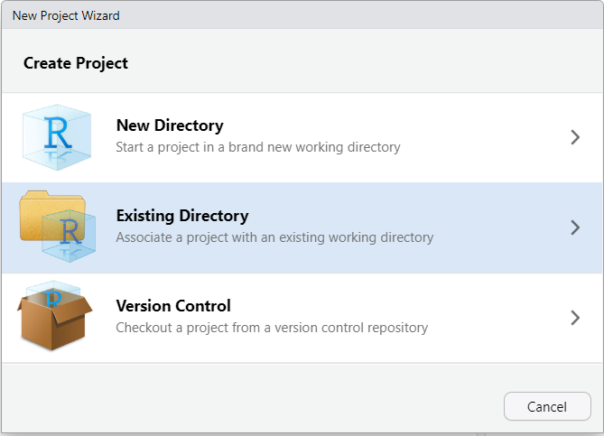
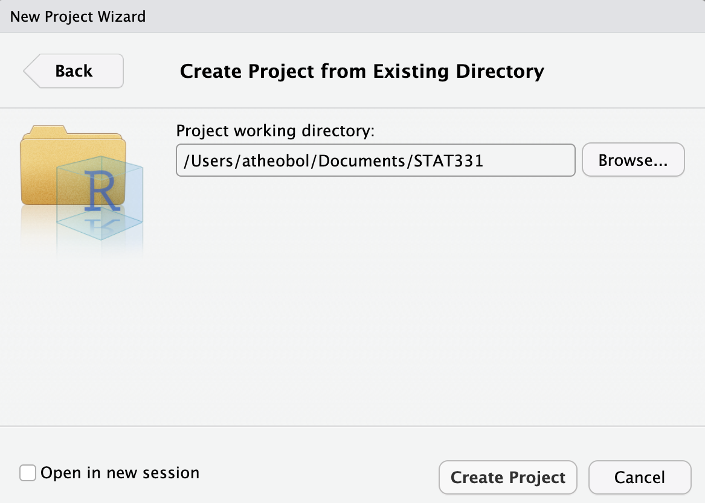
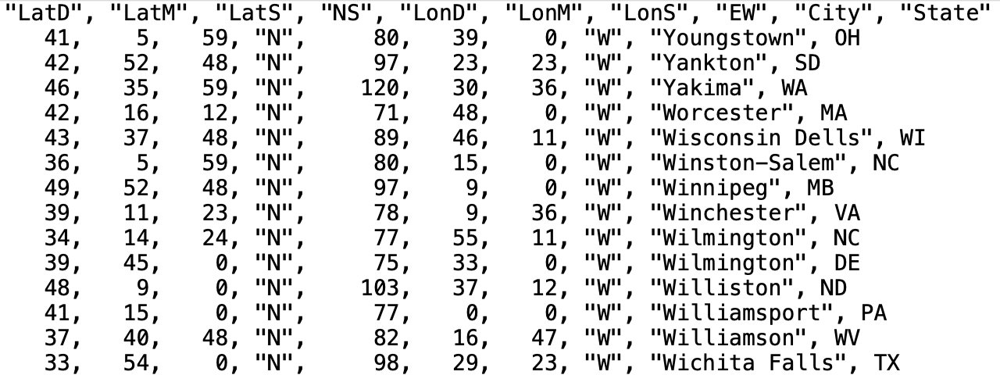
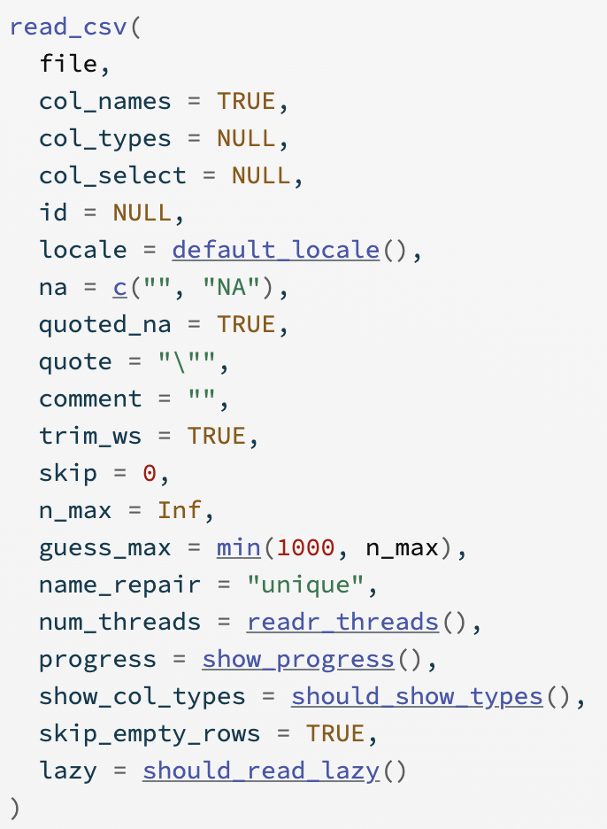





```{r}
#| label: setup
#| include: false
library(tidyverse)
```

## Learning Objectives

-   Describe what an R Project is
-   Outline how an R Project affects the file paths used to read in data\
-   Read in data from common formats into R
-   Identify missing data and type of missingness

#### 📽 Watch Videos: See Canvas

#### `r emo::ji("book")` Readings: 30-45 minutes

#### `r emo::ji("check")` Check-ins: 1

# Directories, Paths, and Projects

We have learned how to organize our personal files and locate them using absolute and relative file paths. The idea of a "base folder" or starting place was introduced as a **working directory**. In `R`, there are two ways to set up your file path and file system organization:

1.  Set your working directory in `R` (do not recommend)
2.  Use R Projects (preferred!)

## Working Directories in `R`

To find where your working directory is in `R`, you can either look at the top of your console or type `getwd()` into your console.

```{r}
#| label: get-wd
#| eval: false
getwd()
```

Although it is not recommended, you can set your working directory in `R` with `setwd()`:

```{r}
#| label: setting-full-path
#| eval: false

setwd("/path/to/my/assignment/folder")
```

::: column-margin
{fig-alt="A cartoon of a cracked glass cube looking frustrated with casts on its arm and leg, with bandaids on it, containing 'setwd', looks on at a metal riveted cube labeled 'R Proj' holding a skateboard looking sympathetic, and a smaller cube with a helmet on labeled 'here' doing a trick on a skateboard."}
:::

::: callout-caution
### File Paths in `R`

A quick warning on file paths is that Mac / Linux and Windows differ in the direction of their backslash to separate folder locations. Mac/Linux use `/` (e.g. `STAT210/Week1`) while Window's uses `\` (e.g. `STAT210\Week1`).
:::

## R Projects

📖 [Review Reading: Workflow (R Projects)](https://r4ds.hadley.nz/workflow-scripts.html#projects)

::: callout-note
# Only read Section 6.2!
:::

### Create an R Project from an Existing Folder

So far, each time we have worked in R we have created an R Project. The R Project lives in the created folder for two reasons, (1) when you copy a GitHub repository you told RStudio you wanted to make a new R Project, and (2) in order for RStudio to talk with GitHub you need to use an R Project.

However, if you look in any other folder on your computer, you **should not** see a blue cube since you never created an R Project in those folders. Suppose we have a project we've been work on and we never created an official R Project for it (perhaps it is a folder filled with data sets or someone sent a zipped filed that didn't contain an R Project file (.RProj).

To add a R Project to an existing folder on your computer (e.g., you already created a folder for the project), first open RStudio on your computer and click `File > New Project`, then select `Existing Directory`:

{width="50%" fig-align="center" fig-alt="Screenshot of navigation box that appears when you select 'File' and 'New Project'. The 'Existing Directory' option is highlighted in blue."}

Then, browse on your computer to where you saved your project folder (it should be on your hard drive and not on iCloud, Google Drive, or One Drive). For example, let's say you had a folder called `STAT331` that you wanted to turn into a R Project. Select that folder.

{width="50%" fig-align="center" fig-alt="Screenshot of navigation box that appears when you select 'Existing Directory' from the previous navigation menue. By clicking on the 'Browse' button you can navigate to the existing folder where you would like to insert the R Project. In the image, I've navigated to my STAT331 folder which lives in my Documents."}

Once you click "Create Project", your existing folder, `STAT331` should now contain a `STAT331.Rproj` file. This is your new "home" base for this class - whenever you refer to a file with a relative path it will begin to look for it here.

If you would like a list of step-by-step instructions for this process, feel free to look at this file: [Creating a Project in an Existing Directory](https://scribehow.com/shared/Creating_a_Project_in_an_Existing_Directory__7NTs-4d2RtO1octP6rrBTQ)

------------------------------------------------------------------------


# Tidy Data

## Tidy Data

{fig-alt="An educational graphic explaining 'Tidy Data' with text and a simple table. The main text at the top reads, 'TIDY DATA is a standard way of mapping the meaning of a dataset to its structure,' followed by the attribution to Hadley Wickham. Below, it explains the concept of tidy data: 'In tidy data: each variable forms a column, each observation forms a row, each cell is a single measurement.' To the right, there is a small table with three columns labeled 'id,' 'name,' and 'color,' demonstrating how each column is a variable and each row is an observation. The table contains entries such as 'floof' (gray), 'max' (black), and 'panda' (calico). The image ends with a citation for Hadley Wickham's 2014 paper on Tidy Data."}

## Same Data, Different Formats

Different formats of the data are **tidy** in different ways.

```{r}
#| label: creating-small-data-set-wide-format
#| echo: false
#| eval: true

bb_wide <- tibble(Team = c("A", "B", "C", "D"),
                       Points   = c(88, 91, 99, 94),
                       Assists  = c(12, 17, 24, 28),
                       Rebounds = c(22, 28, 30, 31)
                       )
```

::: panel-tabset
### Option 1

```{r}
#| label: displaying-wide-data
#| echo: false
#| eval: true

bb_wide |> 
  knitr::kable()
```

### Option 2

```{r}
#| label: transforming-to-long
#| echo: false
#| eval: true

bb_long <- bb_wide |> 
  pivot_longer(cols      = c(Points, Assists, Rebounds),
               names_to  = "Statistic",
               values_to = "Value"
               )

bb_long |> 
  knitr::kable()
```
:::

## Connection to ggplot

Let's make a plot of each team's statistics!

::::: panel-tabset
### Option 1 - Wide Data

::: small
```{r}
#| label: plot-with-wide-data
#| echo: true
#| eval: true
#| code-fold: true
#| fig-width: 6
#| fig-height: 4
#| fig-align: center
#| fig-alt: "Data Viz of Wide Data"

ggplot(data = bb_wide, 
       mapping = aes(x = Team)) +
  geom_point(mapping = aes(y = Points, 
                           color = "Points"), 
             size = 4) +
  geom_point(mapping = aes(y = Assists, 
                           color = "Assists"), 
             size = 4) +
  geom_point(mapping = aes(y = Rebounds, 
                           color = "Rebounds"), 
             size = 4) + 
  scale_colour_manual(
    values = c("darkred", 
               "steelblue", 
               "forestgreen")) +
  labs(color = "Statistic")
```
:::

### Option 2 - Long Data

::: small
```{r}
#| label: plot-with-long-data
#| echo: true
#| eval: true
#| code-fold: true
#| fig-width: 6
#| fig-height: 4
#| fig-align: center
#| fig-alt: "Data Viz of Long Data"

ggplot(data = bb_long, 
       mapping = aes(x = Team, 
                     y = Value, 
                     color = Statistic)) +
  geom_point(size = 4) + 
  scale_colour_manual(
    values = c("darkred", 
               "steelblue", 
               "forestgreen")) +
  labs(color = "Statistic")
```
:::
:::::


{fig-alt="An illustration featuring a cute, cartoonish scene with three characters sitting on a bench. In the center, there is a smiling blue rectangular character resembling a tidy data table, holding an ice cream cone. On either side of the table are two round, fluffy creatures: one pink on the left and one green on the right, both also holding ice cream cones. Above the characters, the text reads 'make friends with tidy data.' The overall tone of the image is friendly and inviting, encouraging positive feelings toward tidy data."}

# Loading Data Into R

## How do I load my data?

`r emo::ji("book")` [Required Reading: Data Import](https://r4ds.hadley.nz/data-import.html)

<!-- ## Where does my data live? -->

<!-- `r emo::ji("check")` Check-in: Loading Data -->

<!-- For this check-in you are asked to work through reading in different data sets. You are expected to create your own Quarto document to complete this activity. -->

<!-- The folder Age_Data contains several data sets with the names and ages of five individuals. The data sets are stored as different file types. [Download Ages_Data.zip here](Ages_Data.zip), make sure to unzip the folder, save these in a reasonable place (e.g., `STAT210 > Week 5 > Checkins` or `STAT210 > Checkins > Week 5`). -->

<!-- ::: callout-tip -->
<!-- ## Extracting zip folders -->

<!-- You will need to **extract** the contents of the `ages.zip` file, that means you will need to uncompress the files from the folder for RStudio to know where to get the data from. -->
<!-- ::: -->


## Common Types of Data Files

Look at the **file extension** for the type of data file.

::::: columns
::: {.column width="70%"}
`.csv` : "comma-separated values"
:::

::: {.column width="30%"}
```         
Name, Age
Bob, 49
Joe, 40
```
:::
:::::

`.xls`, `.xlsx`: Microsoft Excel spreadsheet

-   Common approach: save as `.csv`
-   Nicer approach: use the `readxl` package


`.txt`: plain text

-   Could have any sort of delimiter...
-   Need to let R know what to look for!

## Common Types of Data Files

What is the delimiter (e.g. comma, tab, space, etc.) for each data file?

::: panel-tabset
### File A

{fig-alt="Data table of a csv file where variables and values are separated by commas"}

### File B

{fig-alt="Data table of a tsv file where variables and values are separated by tabs"}

### File C

{fig-alt="Data table of a pipe file where variables and values are separated by pipes "}

### Sources

-   [File A](https://people.sc.fsu.edu/~jburkardt/data/csv/csv.html)
-   [File B](https://github.com/ccusa/Disaster_Vulnerability_Map/blob/master/sample-data.tsv)
-   [File C](https://chadbaldwin.net/2021/03/24/quick-parse-csv-file.html)
:::

## Loading External Data

Using **base** `R` functions:

-   `read.csv()` is for reading in `.csv` files.

-   `read.table()` and `read.delim()` are for any data with "columns" (you specify the separator).

## Loading External Data

The **tidyverse** has some cleaned-up versions in the `readr` and `readxl` packages:

::: small
-   `readr` package is loaded with `library(tidyverse)`

    -   `read_csv()` is for comma-separated data.

    -   `read_tsv()` is for tab-separated data.

    -   `read_table()` is for white-space-separated data.

    -   `read_delim()` is any data with "columns" (you specify the separator). The above are special cases.

-   `readxl` will need need to be loaded separately with `library(readxl)`

    -   `read_xls()` and `read_xlsx()` are specifically for dealing with Excel files.
:::

Remember to load the `readr` and `readxl` packages first!

## What's the difference?

Compare the two functions `read.csv()` and `read_csv()` - what do you notice about the possible arguments you can use in each? Why is `read_csv()` the better option?

:::::: columns
::: {.column width="47%"}

:::

::: {.column width="3%"}
:::

::: {.column width="48%"}

:::
::::::

## Practice with Importing Data

Use the `readr` and `readxl` packages to complete the following exercises.

1.  Load the appropriate packages for reading in data.

```{webr}
#| label: setup-webr
#| exercise: ex_1
#| caption: Loading Packages
library(_________) #for most data files
library(_________) #for excel data files
```


::: {.solution exercise="ex_1"}

#### Solution

`library()` loads in packages. You need to supply the package name you need to load inside the parentheses.

```{webr}
#| exercise: ex_1
#| solution: true
library(readr) #for most data files
library(readxl) #for excel data files
```

:::

```{webr}
#| exercise: ex_1
#| check: true
gradethis::grade_this_code()
```


2.  Read in the data set *ages.csv*. Suppress the column names and other output by adding an argument to the function.


```{webr}
#| label: read-ages-csv
#| exercise: ex_2
ages <- read_____("ages.csv")
head(ages)
```


::: {.solution exercise="ex_2"}

#### Solution

Add an argument to suppress the column names and other output. 

```{webr}
#| exercise: ex_2
#| solution: true
ages <- read_csv("ages.csv", show_col_types = FALSE)
head(ages)
```

:::

```{webr}
#| exercise: ex_2
#| check: true
gradethis::grade_this_code()
```


3.  Read in the data set *ages_space.txt*, which is tab delimited.  

```{webr}
#| label: read-ages-tab
#| exercise: ex_3
ages <- read_____("ages_space.txt")
head(ages)
```


::: {.solution exercise="ex_3"}

#### Solution

Add an argument to suppress the column names and other output. 

```{webr}
#| exercise: ex_3
#| solution: true
ages <- read_tsv("ages_tab.txt", show_col_types = FALSE)
head(ages)
```

:::

```{webr}
#| exercise: ex_3
#| check: true
gradethis::grade_this_code()
```


4.  Read in the data set *ages_mystery.txt*. We don't know what the delimiter is here.

```{webr}
#| label: read-ages-mystery
#| exercise: ex_4
ages <- read_____("ages_mystery.txt")
head(ages)
```


::: {.solution exercise="ex_4"}

#### Solution

Add an argument to suppress the column names and other output. 

```{webr}
#| exercise: ex_4
#| solution: true
ages <- read_delim("ages_mystery.txt", show_col_types = FALSE)
head(ages)
```

:::

```{webr}
#| exercise: ex_4
#| check: true
gradethis::grade_this_code()
```


5.  Read in the data set *ages.xlsx* - notice this is an excel file. 

```{webr}
#| label: read-ages-excel
#| exercise: ex_5
ages <- read_____("ages.xlsx")
head(ages)
```


::: {.solution exercise="ex_5"}

#### Solution

Add an argument to suppress the column names and other output. 

```{webr}
#| exercise: ex_5
#| solution: true
ages <- read_excel("ages.xlsx")
head(ages)
```

:::

```{webr}
#| exercise: ex_5
#| check: true
gradethis::grade_this_code()
```


6.  Find a way to use `read_csv()` to read *ages.csv* with the variable "Name" as a factor data type and "Age" as a character data type.

```{webr}
#| label: read-ages-csv-mod
#| exercise: ex_6
ages <- read_csv("ages.csv", ___________)
head(ages)
```


::: {.solution exercise="ex_6"}

#### Solution

There are several solutions to this - try some others to see if you can get similar results. 

```{webr}
#| exercise: ex_6
#| solution: true
ages <- read_csv("ages.csv", 
                 col_types = cols(Name = "f", 
                                  Age = "c"))
head(ages)
```

:::

```{webr}
#| exercise: ex_6
#| check: true
gradethis::grade_this_code()
```


## Import Multiple Files at Once

If you have multiple files that are organized the same way (same variables names/columns), you can actually import them all at once and combine into one file. Check out the following tutorial:




## Additional Readings

📖 [Reading: Missing Data (18.1-18.2)](https://r4ds.hadley.nz/missing-values)

📖 [Reading: Naniar Package Overview](https://naniar.njtierney.com/articles/naniar.html#introduction)
